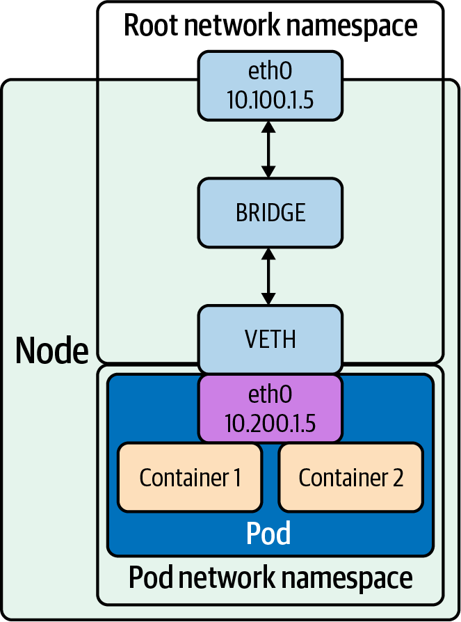

# The Bridge Interface
The bridge interface (shown in Figure 2-1) allows system administrators to create multiple layer 2 networks on a 
single host. In other words, the bridge functions like a network switch between network interfaces on a host, 
seamlessly connecting them. Bridges allow pods, with their individual network interfaces, to interact with the 
broader network via the node’s network interface.


```shell
# # Add a new bridge interface named br0.
ip link add br0 type bridge
# # Attach eth0 to our bridge.
ip link set eth0 master br0
# # Attach veth to our bridge.
ip link set veth master br0
```
In the above code, we demonstrate how to create a bridge device named br0 and attach a virtual Ethernet (veth) device, 
veth, and a physical device, eth0, using ip.


## veth device
The veth device is a local Ethernet tunnel. Veth devices are created in pairs, as shown in Figure 2-1, where the pod 
sees an eth0 interface from the veth. Packets transmitted on one device in the pair are immediately received on the 
other device. When either device is down, the link state of the pair is down. Adding a bridge to Linux can be done 
with using the brctl commands or ip. Use a veth configuration when namespaces need to communicate to the main host 
namespace or between each other.

```shell
ip netns add net1
ip netns add net2
ip link add veth1 netns net1 type veth peer name veth2 netns net2
```

In the above code, we show the steps to create two network namespaces (not to be confused with Kubernetes namespaces), 
net1 and net2, and a pair of veth devices, with veth1 assigned to namespace net1 and veth2 assigned to namespace net2. 
These two namespaces are connected with this veth pair. Assign a pair of IP addresses, and you can ping and communicate 
between the two namespaces.

