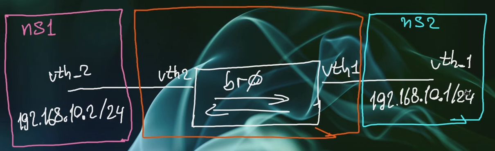

# Lab


## commands
```shell
# show links
ip -c -br link
ip link add name br0 type bridge
# create bridge
ip link add name br0 type bridge
# show bridge
ip -c link show br0

# show with more detailes
ip -d -c link show br0

# create two vth
ip link add name vth1 type veth peer vth_1
ip link add name vth2 type veth peer vth_2
```