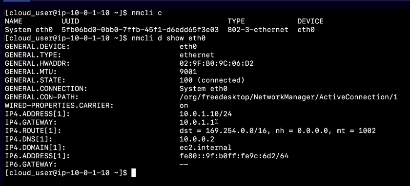

# convert dhcp to static ip
This will show how to setup static ip using nmcli. we will use `nmcli c`



## configure ip
first let us get the existing connection 
```
nmcli c

# get the device information this will show all needed information to setup ip
nmcli d show eth0

# set up static ip
nmcli con mod System\ eth0 ipv4.method manual ipv4.addresses 10.0.1.10/24 ipv4.gateway 10.0.1.1 ipv4.dns 10.0.0.2 ipv4.dns-search ec2.internal

# verify ip had been set
nmcli con show System\ eth0 | grep ipv4

# restart network
systemctl restart network
```


