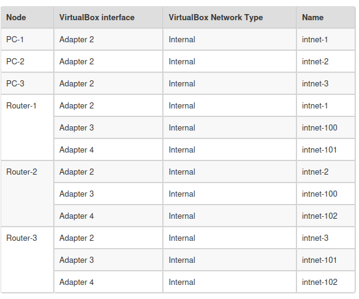

# Networking lab
this lab setup three machines and three routers .
this lab had been taken from [How to emulate a network using VirtualBox](https://www.brianlinkletter.com/2016/07/how-to-use-virtualbox-to-emulate-a-network/)

## lab setup
This lab uses virtual box.



## router machines
these machines use ubuntu server. every machine has four network adapters. the first one is a `NAT` with 
port forwarding to ssh port, while the others are `Internal Networks`

### router 1

#### setup router software(frr) for router 1
```
bash <<EOF2
sed -i 's/ubuntu/router-1/g' /etc/hostname
sed -i 's/ubuntu/router-1/g' /etc/hosts
hostname router-1
apt-get -y update
apt-get -y install frr frr-doc traceroute
#cp /usr/share/doc/frr/examples/zebra.conf.sample /etc/frr/zebra.conf
#cp /usr/share/doc/frr/examples/ospfd.conf.sample /etc/frr/ospfd.conf
#chown frr.frr /etc/frr/*.conf
#chmod 640 /etc/frr/*.conf
sed -i s'/zebra=no/zebra=yes/' /etc/frr/daemons
sed -i s'/ospfd=no/ospfd=yes/' /etc/frr/daemons
echo 'VTYSH_PAGER=more' >>/etc/environment 
echo 'export VTYSH_PAGER=more' >>/etc/bash.bashrc
cat >> /etc/frr/frr.conf << EOF
interface enp0s8
interface enp0s9
interface enp0s10
interface lo
router ospf
 passive-interface enp0s8
 network 192.168.1.0/24 area 0.0.0.0
 network 192.168.100.0/24 area 0.0.0.0
 network 192.168.101.0/24 area 0.0.0.0
line vty
EOF
cat >> /etc/frr/frr.conf << EOF
interface enp0s8
 ip address 192.168.1.254/24
 ipv6 nd suppress-ra
interface enp0s9
 ip address 192.168.100.1/24
 ipv6 nd suppress-ra
interface enp0s10
 ip address 192.168.101.2/24
 ipv6 nd suppress-ra
interface lo
ip forwarding
line vty
EOF
systemctl start frr
exit
EOF2
```

#### support network manager
To us the `cmcli` you need to use the network manager renderer
```
cat >> /etc/netplan/00-installer-config.yaml << EOF
  renderer: NetworkManager
EOF
netplan apply
```

### router 2
#### configure static ips


#### setup router software(frr)
```
bash <<EOF2
sed -i 's/ubuntu/router-2/g' /etc/hostname
sed -i 's/ubuntu/router-2/g' /etc/hosts
hostname router-2
apt-get -y update
apt-get -y install frr frr-doc traceroute
#cp /usr/share/doc/frr/examples/zebra.conf.sample /etc/frr/zebra.conf
#cp /usr/share/doc/frr/examples/ospfd.conf.sample /etc/frr/ospfd.conf
#chown frr.frr /etc/frr/*.conf
#chmod 640 /etc/frr/*.conf
sed -i s'/zebra=no/zebra=yes/' /etc/frr/daemons
sed -i s'/ospfd=no/ospfd=yes/' /etc/frr/daemons
echo 'VTYSH_PAGER=more' >>/etc/environment 
echo 'export VTYSH_PAGER=more' >>/etc/bash.bashrc
cat >> /etc/frr/frr.conf << EOF
interface enp0s8
interface enp0s9
interface enp0s10
interface lo
router ospf
 passive-interface enp0s8
 network 192.168.2.0/24 area 0.0.0.0
 network 192.168.100.0/24 area 0.0.0.0
 network 192.168.102.0/24 area 0.0.0.0
EOF
cat >> /etc/frr/frr.conf << EOF
interface enp0s8
 ip address 192.168.2.254/24
 ipv6 nd suppress-ra
interface enp0s9
 ip address 192.168.100.2/24
 ipv6 nd suppress-ra
interface enp0s10
 ip address 192.168.102.2/24
 ipv6 nd suppress-ra
interface lo
ip forwarding
line vty
EOF
systemctl start frr
exit
EOF2
```

#### support network manager
To us the `cmcli` you need to use the network manager renderer
```
cat >> /etc/netplan/00-installer-config.yaml << EOF
  renderer: NetworkManager
EOF
netplan apply
```

### router 3

#### setup router software(frr)
```
bash <<EOF2
sed -i 's/ubuntu/router-3/g' /etc/hostname
sed -i 's/ubuntu/router-3/g' /etc/hosts
hostname router-3
apt-get -y update
apt-get -y install frr frr-doc traceroute
#cp /usr/share/doc/frr/examples/zebra.conf.sample /etc/frr/zebra.conf
#cp /usr/share/doc/frr/examples/ospfd.conf.sample /etc/frr/ospfd.conf
#chown frr.frr /etc/frr/*.conf
#chmod 640 /etc/frr/*.conf
sed -i s'/zebra=no/zebra=yes/' /etc/frr/daemons
sed -i s'/ospfd=no/ospfd=yes/' /etc/frr/daemons
echo 'VTYSH_PAGER=more' >>/etc/environment 
echo 'export VTYSH_PAGER=more' >>/etc/bash.bashrc
cat >> /etc/frr/frr.conf << EOF
interface enp0s8
interface enp0s9
interface enp0s10
interface lo
router ospf
 passive-interface enp0s8
 network 192.168.3.0/24 area 0.0.0.0
 network 192.168.101.0/24 area 0.0.0.0
 network 192.168.102.0/24 area 0.0.0.0
EOF
cat >> /etc/frr/frr.conf << EOF
interface enp0s8
 ip address 192.168.3.254/24
 ipv6 nd suppress-ra
interface enp0s9
 ip address 192.168.101.1/24
 ipv6 nd suppress-ra
interface enp0s10
 ip address 192.168.102.1/24
 ipv6 nd suppress-ra
interface lo
ip forwarding
line vty
EOF
systemctl start frr
exit
EOF2
```

#### support network manager
To us the `cmcli` you need to use the network manager renderer
```
cat >> /etc/netplan/00-installer-config.yaml << EOF
  renderer: NetworkManager
EOF
netplan apply
```

## pc machines connected to routers
these machines use ubuntu server. every machine has two network adapters. the first one is a `NAT` with
port forwarding to ssh port, while the other one is `Internal Networks`

### pc1
#### configure static ip
```
sudo su
nano /etc/netplan/00-installer-config.yaml

#add these
    enp0s8:
      dhcp4: false
      dhcp6: false
      addresses:
        - 192.168.1.1/24
      routes:
        - to: 192.168.0.0/16
          via: 192.168.1.254
#      nameservers:
 #       addresses: [192.168.1.254]
```

```
netplan apply
```

#### configure pc1
```
bash <<EOF2
sed -i 's/ubuntu/pc-1/g' /etc/hostname
sed -i 's/ubuntu/pc-1/g' /etc/hosts
hostname pc-1
EOF2
reboot
```

#### support network manager
To us the `cmcli` you need to use the network manager renderer
```
cat >> /etc/netplan/00-installer-config.yaml << EOF
  renderer: NetworkManager
EOF
netplan apply
```

### pc2
#### configure static ip
```
sudo su
nano /etc/netplan/00-installer-config.yaml

#add these
    enp0s8:
      dhcp4: false
      dhcp6: false
      addresses:
        - 192.168.2.1/24
      routes:
        - to: 192.168.0.0/16
          via: 192.168.2.254
#      nameservers:
 #       addresses: [192.168.2.254]
```

```
netplan apply
```

#### configure pc3
```
bash <<EOF2
sed -i 's/ubuntu/pc-2/g' /etc/hostname
sed -i 's/ubuntu/pc-2/g' /etc/hosts
hostname pc-2
EOF2
reboot
```


#### support network manager
To us the `cmcli` you need to use the network manager renderer
```
cat >> /etc/netplan/00-installer-config.yaml << EOF
  renderer: NetworkManager
EOF
netplan apply
```

### pc3
#### configure static ip
```
sudo su
nano /etc/netplan/00-installer-config.yaml

#add these
    enp0s8:
      dhcp4: false
      dhcp6: false
      addresses:
        - 192.168.3.1/24
      routes:
        - to: 192.168.0.0/16
          via: 192.168.3.254
#      nameservers:
 #       addresses: [192.168.2.254]
```

```
netplan apply
```

#### configure pc3
```
bash <<EOF2
sed -i 's/ubuntu/pc-3/g' /etc/hostname
sed -i 's/ubuntu/pc-3/g' /etc/hosts
hostname pc-3
EOF2
reboot
```


#### support network manager
To us the `cmcli` you need to use the network manager renderer
```
cat >> /etc/netplan/00-installer-config.yaml << EOF
  renderer: NetworkManager
EOF
netplan apply
```


### lab-pc
#### configure static ip
This pc is connected to internal network 1. it is static ip is not configured

#### configure pc3
```
bash <<EOF2
sed -i 's/ubuntu/lab-pc/g' /etc/hostname
sed -i 's/ubuntu/lap-pc/g' /etc/hosts
hostname lap-pc
EOF2
cat >> /etc/netplan/00-installer-config.yaml << EOF
  renderer: NetworkManager
EOF
netplan apply
reboot
```


#### support network manager
To us the `cmcli` you need to use the network manager renderer
```
cat >> /etc/netplan/00-installer-config.yaml << EOF
  renderer: NetworkManager
EOF
netplan apply
```

