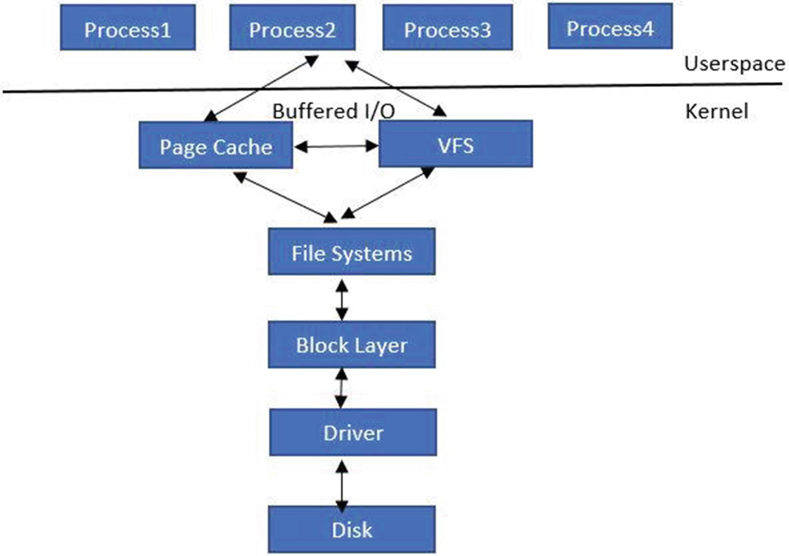

# Cgroups
What stops a process running on a namespace from launching a process that possibly could hog the CPU via an infinite 
loop? Flawed code can keep leaking memory (say, for example, it takes a big chunk of the OS page cache). A misbehaving 
process can create tons of processes via forking, launch a fork bomb, and crash the kernel.

This means we need a way to introduce resource controls for processes within the namespace. This is achieved using a 
mechanism called control groups , commonly known as **cgroups**. cgroups work on the concept of cgroup controllers and 
are represented by a file system called **cgroupfs** in the Linux kernel.

## Creating a Sample cgroup
```shell
sudo su
mkdir todel
mount -t cgroup2 none todel
ls -la todel

# then run to see the mount you just created
mount | grep cgroup
```
we can see multiple files there:
* cgroup.controllers: This file contains the supported controllers.
* Cgroup.procs: This file contains the processes within the root cgroup. No PIDs will be there when the cgroup is freshly created. By writing the PIDs to this file, they become part of the cgroup.
* Cgroup.subtree_control: This holds controllers that are enabled for the immediate subgroup.
Enabling and disabling controllers in the immediate subgroups of a parent is done only by writing into its 
cgroup.subtree_control file. So, for example, enabling the memory controller is done using this:
  `echo "+memory" > mygrp/cgroup.subtree_control`
  And disabling it is done using this:
  `echo "-memory" > mygrp/cgroup.subtree_control`
* cgroup.events: This is the cgroup core interface file. This interface file is unique to non-root subgroups. The cgroup.events file reflects the number of processes attached to the subgroup, and it consists of one item—populated: value. The value is 0 when there are no processes attached to that subgroup or its descendants, and 1 when there are one or more processes attached to that subgroup or its descendants.
* pids.max: to avoid situations like a fork bomb.
* memory.events: which can be monitored for events like OOM.

## Cgroup Types
There are different types of cgroups, based on which resources we want to control. Two of the cgroups we will cover are as follows:
* CPU: Provides CPU limits to user space processes
* Block I/O: Provides I/O limits on block devices for user space processes

### CPU Cgroup
From the kernel perspective, let’s see how a cgroup is realized. CPU cgroups can be realized on top of two schedulers:
* Completely fair scheduler
* Real-time scheduler

In this chapter, we discuss only the **completely fair scheduler (CFS)**.

The CPU cgroup provides two types of CPU resource control:
* cpu.shares: Contains an integer value that specifies a relative share of CPU time available to the tasks in a cgroup. 
For example, tasks in two cgroups that have cpu.shares set to 100 will receive equal CPU time, but tasks in a cgroup 
that have cpu.shares set to 200 receive twice the CPU time of the tasks in a cgroup where cpu.shares is set to 100. 
The value specified in the cpu.shares file must be 2 or higher.

* cpu.cfs_quota_us: Specifies the total amount of time in microseconds (μs, represented here as “us”) for which all 
tasks in a cgroup can run during one period (as defined by cpu.cfs_period_us). As soon as tasks in a cgroup use all the
time specified by the quota, they are stopped for the remainder of the time specified by the period and not allowed 
to run until the next period.

* Cpu.cfs_period_us: It is the period from which CPU quotas for cgroups (cpu.cfs_quota_us) are carved out and the 
quota and period parameters operate on a per CPU basis. Consider these examples:
To allow the cgroup to be able to access a single CPU for 0.2 seconds of every second, set the cpu.cfs_quota_us to
200000 and cpu.cfs_period_us to 1000000.

To allow a process to utilize 100% of a single CPU, set cpu.cfs_quota_us to 1000000 and cpu.cfs_period_us to 1000000.

To allow a process to utilize 100% of two CPUs, set cpu.cfs_quota_us to 2000000 and cpu.cfs_period_us to 1000000.

To understand both of these control mechanisms, we can look into the aspects of the Linux CFS task scheduler. The aim 
of this scheduler is to grant a fair share of the CPU resources to all the tasks running on the system.

We can break up these tasks into two types:
* CPU-intensive tasks: Tasks like encryption, machine learning, query processing, and so on
* I/O-intensive tasks: Tasks that are using disk or network I/O like DB clients

The scheduler has the responsibility of scheduling both kinds of tasks. The CFS uses a concept of a **vruntime**. vruntime 
is a member of the sched_entity structure, which is a member of the **task_struct** structure (each process is represented 
in Linux by a task_struct structure):
```shell
struct task_struct {
        int prio, static_prio, normal_prio; 
        unsigned int rt_priority;
        struct list_head run_list;
        const struct sched_class *sched_class;
        struct sched_entity se;
        unsigned int policy; 
        cpumask_t cpus_allowed; 
        unsigned int time_slice;
        }
struct sched_entity {
       /* For load-balancing: */
       struct load_weight        load;
       struct rb_node            run_node;
       struct list_head          group_node;
       unsigned int              on_rq;
       u64                       exec_start;
       u64                       sum_exec_runtime;
       u64                       vruntime;
       u64                       prev_sum_exec_runtime;
       u64                       nr_migrations;
       struct sched_statistics   statistics;
#ifdef CONFIG_FAIR_GROUP_SCHED
       Int                   depth;
       struct sched_entity      *parent;
       /* rq on which this entity is (to be) queued: */
       struct cfs_rq            *cfs_rq;
       /* rq "owned" by this entity/group: */
       struct cfs_rq            *my_q;
       /* cached value of my_q->h_nr_running */
       unsigned long            runnable_weight;
```

The task_struct has a reference to sched_entity , which holds a reference to vruntime.

vruntime is calculated using these steps:
1. Compute the time spent by the process on the CPU.
2. Weigh the computed running time against the number of runnable processes.

The kernel uses the update_curr function defined in the https://elixir.bootlin.com/linux/latest/source/kernel/sched/fair.c file.
```
/*
 * Update the current task's runtime statistics.
 */
static void update_curr(struct cfs_rq *cfs_rq)
{
       struct sched_entity *curr = cfs_rq->curr;
       u64 now = rq_clock_task(rq_of(cfs_rq));
       u64 delta_exec;
       if (unlikely(!curr))
              return;
       delta_exec = now - curr->exec_start;
       if (unlikely((s64)delta_exec <= 0))
               return;
       curr->exec_start = now


;
       schedstat_set(curr->statistics.exec_max,
              max(delta_exec, curr->statistics.exec_max));
       curr->sum_exec_runtime += delta_exec;
       schedstat_add(cfs_rq->exec_clock, delta_exec);
       curr->vruntime += calc_delta_fair(delta_exec, curr);
       update_min_vruntime(cfs_rq);
       if (entity_is_task(curr)) {
              struct task_struct *curtask = task_of(curr);
              trace_sched_stat_runtime(curtask, delta_exec, curr->vruntime);
              cgroup_account_cputime(curtask, delta_exec);
              account_group_exec_runtime(curtask, delta_exec);
       }
       account_cfs_rq_runtime(cfs_rq, delta_exec);
}
```

Basically, the CFS scheduler schedules its heuristic’s schedules and I/O-intensive tasks more frequently, but gives 
more time to the CPU-intensive tasks in a single run. This also could be understood from the vruntime concept discussed 
previously. Since I/O tasks are mostly waiting for network/disk, their vruntimes tend to be smaller than CPU tasks. 
That means the I/O tasks will be scheduled more frequently. The CPU-intensive tasks will get more time once they are 
scheduled to do the work. This way, CFS tries to attain a fair scheduling of tasks.

Let’s stop for a minute and think about a potential problem this scheduling could lead to.

Assume you have two processes, A and B, belonging to different users. These processes each get 50% share of the CPU. 
Now say a user owning process A launches another process, called A1. Now CFS will give a 33% share to each process. 
This effectively means that users of process A and A1 now get 66% of the CPU. A classic example is a database like 
PostgreSQL, which creates processes per connection. As connections grow, the number of processes grow. If fair 
scheduling is in place, each connection would tend to take away the share of the other non-Postgre processes running 
on the same machine.

This problem led to what we call group scheduling. To understand this, let’s look at other kernel data structure:
```shell
/* CFS-related fields in a runqueue */
struct cfs_rq {
       struct load_weight    load;
       unsigned int           nr_running;
       unsigned int           h_nr_running;    /* SCHED_{NORMAL,BATCH,IDLE} */
       unsigned int           idle_h_nr_running; /* SCHED_IDLE */
       u64                   exec_clock;
       u64                   min_vruntime;
#ifndef CONFIG_64BIT
       u64                   min_vruntime_copy;
#endif
       struct rb_root_cached tasks_timeline;
       /*
        * 'curr' points to currently running entity on this cfs_rq.
        * It is set to NULL otherwise (i.e. when none are currently running).
        */
       struct sched_entity *curr;
       struct sched_entity *next;
       struct sched_entity *last;
       struct sched_entity *skip;
```
This structure holds the number of runnable tasks in the **nr_running** member. The **curr** member is a pointer to 
the current running scheduling entity or the task.

Also, the **sched_entity** is now represented as a hierarchical data structure:
```shell
struct sched_entity {
/* For load-balancing: */
struct load_weight     load;
struct rb_node         run_node;
struct list_head       group_node;
unsigned int           on_rq;
u64                    exec_start;
u64                    sum_exec_runtime;
u64                    vruntime;
u64                    prev_sum_exec_runtime;
u64                    nr_migrations;
struct sched_statistics     statistics;
#ifdef CONFIG_FAIR_GROUP_SCHED
       Int                        depth;
       struct sched_entity      *parent;
       /* rq on which this entity is (to be) queued: */
       struct cfs_rq            *cfs_rq;
       /* rq "owned" by this entity/group: */
       struct cfs_rq            *my_q;
       /* cached value of my_q->h_nr_running */
       unsigned long             runnable_weight;
#endif
#ifdef CONFIG_SMP
       /*
        * Per entity load average tracking.
        *
        * Put into separate cache line so it does not
        * collide with read-mostly values above.
        */
          struct sched_avg avg;
#endif
};
```
This means there can now be **sched_entities** that are not associated with a process (**task_struct**). Instead, these 
entities can represent a group of processes. Each **sched_entity** now maintains a run queue of its own. A process 
can be moved to the child schedule entity, which means it will be part of the run queue that the child schedule 
entity has. This run queue can represent the processes in the group.

The code flow in scheduler would do the following.

**Pick_next_entity** is called to pick up the best candidate for scheduling. We assume that there is only one group 
running at this time. This means that the **red black tree** associated with the **sched_entity** process is blank. 
The method now tries to get the child sched_entity of the current sched_entity. It checks the **cfs_rq**, which has 
the processes of the group enqueued. The process is scheduled.

The **vruntime** is based on the weights of the processes within the group. This allows us to do fair scheduling and 
prevent processes within a group from impacting the CPU usage of processes within other groups.

Once we understand that processes can be placed into groups, let’s see how bandwidth enforcement can be applied to 
the group. Another data structure called **cfs_bandwidth**, defined in _sched.h_, plays a role:
```shell
struct cfs_bandwidth {
#ifdef CONFIG_CFS_BANDWIDTH
       raw_spinlock_t         lock;
       ktime_t                period;
       u64                quota;
       u64                runtime;
       s64                hierarchical_quota;
       u8                 idle;
       u8                 period_active;
       u8                 distribute_running;
       u8                 slack_started;
       struct hrtimer         period_timer;
       struct hrtimer         slack_timer;
       struct list_head   throttled_cfs_rq;
       /* Statistics: */
       Int                nr_periods;
       Int                nr_throttled;
       u64                throttled_time;
#endif
};
```
This structure keeps track of the runtime quota for the group. The **cff_bandwith_used** function is used to return 
a Boolean value when the check is made in the **account_cfs_rq_runtime** method of the fair scheduler implementation 
file. If no runtime quota remains, the **throttle_cfs_rq** method is invoked. It will dequeue the task from the 
run queue of the **sched_entity** and set the throttled flag. The function implementation is shown here:
```shell
static void throttle_cfs_rq(struct cfs_rq *cfs_rq)
{
       struct rq *rq = rq_of(cfs_rq);
       struct cfs_bandwidth *cfs_b = tg_cfs_bandwidth(cfs_rq->tg);
       struct sched_entity *se;
       long task_delta, idle_task_delta, dequeue = 1;
       bool empty;
       se = cfs_rq->tg->se[cpu_of(rq_of(cfs_rq))];
       /* freeze hierarchy runnable averages while throttled */
       rcu_read_lock();
       walk_tg_tree_from(cfs_rq->tg, tg_throttle_down, tg_nop, (void *)rq);
       rcu_read_unlock();
       task_delta = cfs_rq->h_nr_running;
       idle_task_delta = cfs_rq->idle_h_nr_running;
       for_each_sched_entity(se) {
           struct cfs_rq *qcfs_rq = cfs_rq_of(se);
           /* throttled entity or throttle-on-deactivate */
           if (!se->on_rq)
                  break;
           if (dequeue) {
                  dequeue_entity(qcfs_rq, se, DEQUEUE_SLEEP);
           } else {
                  update_load_avg(qcfs_rq, se, 0);
                  se_update_runnable(se);
           }
           qcfs_rq->h_nr_running -= task_delta;
           qcfs_rq->idle_h_nr_running -= idle_task_delta;
           if (qcfs_rq->load.weight)
                  dequeue = 0;
       }
       if (!se)
           sub_nr_running(rq, task_delta)


;
       cfs_rq->throttled = 1;
       cfs_rq->throttled_clock = rq_clock(rq);
       raw_spin_lock(&cfs_b->lock);
       empty = list_empty(&cfs_b->throttled_cfs_rq);
       /*
       * Add to the _head_ of the list, so that an already-started
       * distribute_cfs_runtime will not see us. If disribute_cfs_runtime is
        * not running add to the tail so that later runqueues don't get starved.
        */
       if (cfs_b->distribute_running)
             list_add_rcu(&cfs_rq->throttled_list, &cfs_b->throttled_cfs_rq);
       else
             list_add_tail_rcu(&cfs_rq->throttled_list, &cfs_b->throttled_cfs_rq);
       /*
        * If we're the first throttled task, make sure the bandwidth
        * timer is running.
        */
       if (empty)
             start_cfs_bandwidth(cfs_b);
       raw_spin_unlock(&cfs_b->lock);
}
```

### Block I/O cgroups
The purpose of the block I/O cgroup is twofold:
* Provides fairness to the individual cgroup: Makes use of a scheduler called completely fair queuing.
* Does block i/o throttling: Enforces a quota on the block I/O (bytes as well as iops) per cgroup.

Before delving into details of how the cgroup for block I/O is implemented, we’ll take a small detour to investigate 
how the Linux block I/O works. Figure 4-1 is a high-level block diagram of how the block I/O request flows through 
the user space to the device.


The application issues a read/write request via either the file system or via memory mapped files. In either case, 
the request hits the page cache (kernel buffer for caching file data). With a file system-based call, the 
**virtual file system (VFS)** handles the system call and invokes the underlying registered file system.

The next layer is the block layer where the actual I/O request is constructed. There are three important data 
structures within the block layer:
* Request_queue: A single queue architecture is where there is one request queue per device. This is the queue where 
the block layer, in tandem with the I/O scheduler, queues the request. The device driver drains the request queue 
and submits the request to the actual device.
* Request: The request represents the single I/O request to be delivered to the I/O device. The request is made of a list of bio structures.
* Bio: The bio structure is the basic container for block I/O. Within the kernel is the bio structure. Defined 
in _<linux/bio.h>_, this structure represents block I/O operations that are in flight (active) as a list of segments. 
A segment is a chunk of a buffer that is contiguous in memory.


**bio_vec** represents a specific segment and has a pointer to the page holding the block data at a specific offset.

The requests are submitted to the request queue and drained by the device driver. The important data structures 
involved in implementing the block I/O cgroup within the Linux kernel are shown here:
```shell
struct blkcg {
   struct cgroup_subsys_state    css;
    spinlock_t                   lock;
   struct radix_tree_root        blkg_tree;
   struct blkcg_gq __rcu        *blkg_hint;
   struct hlist_head             blkg_list;
   struct blkcg_policy_data     *cpd[BLKCG_MAX_POLS];
   struct list_head all_blkcgs_node; #ifdef
   CONFIG_CGROUP_WRITEBACK
   struct list_head              cgwb_list;
   refcount_t                    cgwb_refcnt;
#endif
};
```
This structure represents the block I/O cgroup. Each block I/O cgroup is mapped to a request queue, which we explained previously.
```shell
/* association between a blk cgroup and a request queue */
struct blkcg_gq {
   /* Pointer to the associated request_queue */
   struct request_queue    *q;
   struct list_head         q_node;
   struct hlist_node        blkcg_node;
   struct blkcg            *blkcg;
/*
*  Each blkg gets congested separately and the congestion state is
*  propagated to the matching bdi_writeback_congested.
*/
   struct bdi_writeback_congested     *wb_congested;
   /* all non-root blkcg_gq's are guaranteed to have access to parent */
   struct blkcg_gq        *parent;
   /* request allocation list for this blkcg-q pair */
   struct request_list     rl;
   /* reference count */
   atomic_t               refcnt;
   /* is this blkg online? protected by both blkcg and q locks */
   Bool                       online;
   struct blkg_rwstat         stat_bytes;
   struct blkg_rwstat         stat_ios;
   struct blkg_policy_data   *pd[BLKCG_MAX_POLS];
   struct rcu_head           rcu_head;
atomic_t                     use_delay;
atomic64_t                   delay_nsec;
atomic64_t                   delay_start;
u64                          last_delay;
int                          last_use;
};
```

## Understanding Fairness
By fairness, we mean that each cgroup should get a fair share of the I/O issued to the device. To accomplish this, 
a **CFQ (Complete Fair Queuing)** scheduler must be configured. Without cgroups in place, the CFQ scheduler assigns 
each process a queue and then gives a time slice to each queue, thereby handling fairness.

A service tree is a list of active queues/process on which the scheduler runs. So basically, the CFQ scheduler 
services requests from the queues on the service tree.

With cgroup in place, the concept of a **CFQ group** is introduced. Now, instead of scheduling per process, 
the scheduling happens at the group level. This means each cgroup has multiple service trees on which the group 
queues are scheduled. Then there is a global service tree on which the CFQ groups are scheduled.

The CFQ group structure is defined as follows:
```shell
struct cfq_group {
   /* must be the first member */
   struct blkg_policy_data pd;
   /* group service_tree member */
   struct rb_node rb_node;
   /* group service_tree key */
u64 vdisktime;
    /*
    * The number of active cfqgs and sum of their weights under this
    * cfqg. This covers this cfqg's leaf_weight and all children's
    * weights, but does not cover weights of further descendants.
    *
    * If a cfqg is on the service tree, it's active. An active cfqg
    * also activates its parent and contributes to the children_weight
    * of the parent.
    */
   int nr_active;
   unsigned int children_weight;
    /*
    * vfraction is the fraction of vdisktime that the tasks in this
    * cfqg are entitled to. This is determined by compounding the
    * ratios walking up from this cfqg to the root.
    *
    * It is in fixed point w/ CFQ_SERVICE_SHIFT and the sum of all
    * vfractions on a service tree is approximately 1. The sum may
    * deviate a bit due to rounding errors and fluctuations caused by
    * cfqgs entering and leaving the service tree.
    */
   * unsigned int vfraction;
   /*
    * There are two weights - (internal) weight is the weight of this
    * cfqg against the sibling cfqgs. leaf_weight is the weight of
    * this cfqg against the child cfqgs. For the root cfqg, both
    * weights are kept in sync for backward compatibility.
    */
   unsigned int weight;
   unsigned int new_weight;
   unsigned int dev_weight;
   unsigned int leaf_weight;
   unsigned int new_leaf_weight;
   unsigned int dev_leaf_weight;
   /* number of cfqq currently on this group */
   int nr_cfqq;
   /*
    * Per group busy queues average. Useful for workload slice calc.
    * We create the array for each prio class but at runtime it is used
    * only for RT and BE class and slot for IDLE class remains unused.
    * This is primarily done to avoid confusion and a gcc warning.
   */
   unsigned int
   busy_queues_avg[CFQ_PRIO_NR]; /*
    *rr lists of queues with requests. We maintain service trees for
    *RT and BE classes. These trees are subdivided in subclasses
    * of SYNC, SYNC_NOIDLE and ASYNC based on workload type. For
    * the IDLE class there is no subclassification and all the CFQ queues go on
    * a single tree service_tree_idle.
    * Counts are embedded in the cfq_rb_root
    */
   struct cfq_rb_root service_trees[2][3];
   struct cfq_rb_root service_tree_idle;
   u64 saved_wl_slice;
   enum wl_type_t saved_wl_type;
   enum wl_class_t saved_wl_class;
     /* number of requests that are on the dispatch list or inside driver */
   int dispatched;
   struct cfq_ttime ttime;
   struct cfqg_stats stats;       /* stats for this cfqg */
   /* async queue for each priority case */ struct
   cfq_queue *async_cfqq[2][IOPRIO_BE_NR]; struct
   cfq_queue *async_idle_cfqq;
};
```
Each CFQ group contains an “**io weight**” value that can be configured in cgroup. The CFQG’s ( CFQ groups) 
vdisktime decides its position on the “**cfqg service tree**,” and then it’s charged according to the “**io weight**”

## Understanding Throttling
Throttling provides a means to apply resource limits to the block I/O. This enables the kernel to control the max 
block I/O that a user space process can get. The kernel realizes this via the block I/O cgroup.

Throttling the block I/O per cgroup is done using a set of different functions. The first function is 
**blk_throttl_bio** and it’s defined in blk-throttle.c (see https://elixir.bootlin.com/linux/latest/source/block/blk-throttle.c ):

