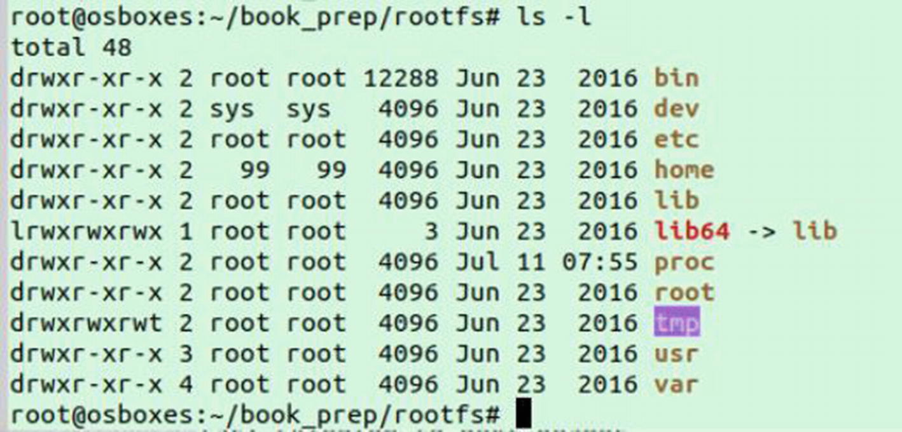
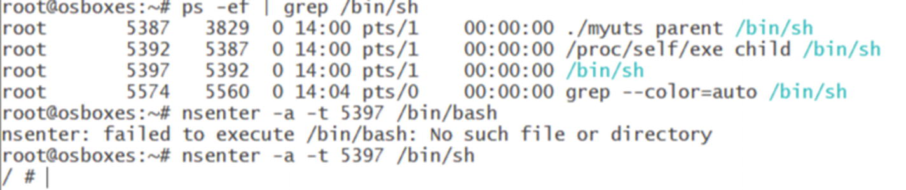
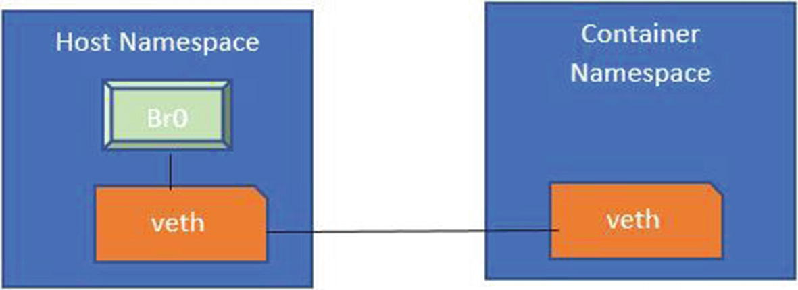

# Creating a Simple Container Framework

## The UTS Namespace
```shell
unshare -u /bin/bash
hostname
echo you should see your old hostname

# let us change the UTC namespace hostname
hostname test
hostname 
echo you should see test

# before you exit open another terminal 
lsns | grep /bin/bash
echo you should see
echo uts         1 125288 root             /bin/bash
# close the terminal

# exit namespace
exit
```

The command **unshare -u /bin/bash** creates the uts namespace and executes our process (/bin/bash) within that 
namespace. The careful reader might observe that if we don’t change the hostname after entering the namespace, 
we still get the hostname of the host. This is not desirable, as we need a way to set this before executing our 
program within the namespace.

This is where we will explore writing a container using Golang (also called Go) and then set up namespaces before 
we launch the process within the container.

## Building a Container with a Namespace
Let’s revisit Linux namespaces briefly before we build the container. Namespaces are in the Linux kernel, similar to 
sandbox kernel resources like file systems, process trees, message queues, and semaphores, as well as network 
components like devices, sockets, and routing rules.

Namespaces isolate processes within their own execution sandbox so that they run completely isolated from other 
processes in different namespaces.

There are six namespaces:
* PID namespace: The processes within the PID namespace have a different process tree. They have an init process with a PID of 1.
* Mount namespace: This namespace controls which mount points a process can see. If a process is within a namespace, 
it will only see the mounts within that namespace.
* UTS namespace: This allows a process to see a different namespace than the actual global namespace.
* Network namespace: This namespace gives a different network view within a namespace. Network constructs like ports, 
iptables, and so on, are scoped within the namespace.
* IPC namespace: This namespace confines interprocess communication structures like pipes within a specific namespace.
* User-namespace: This namespace allows for a separate user and group view within the namespace.

We don’t discuss the cgroup namespace here, which also allows the cgroups to be scoped into their own namespaces.

### Run utc example
```shell
cd containers/container-framework
go build utc.go
sudo ./utc

# list name space run this command from another terminal
lsns | grep /bin/bash
echo you should see: uts         3 126091 root             /bin/bash

# another way of getting same result
ls -li /proc/self/ns/uts

##clean up
exit
```

### Adding More Namespaces
```shell
cd containers/container-framework
go build manyns.go
sudo ./manyns

lsns | grep /bin/bash
echo you should see: 
echo        NS TYPE   NPROCS    PID USER   COMMAND
echo 4026531834 time        2 127335 nobody /bin/bash
echo 4026531835 cgroup      2 127335 nobody /bin/bash
echo 4026532822 user        2 127335 nobody /bin/bash
echo 4026534863 mnt         2 127335 nobody /bin/bash
echo 4026534864 uts         2 127335 nobody /bin/bash
echo 4026534865 ipc         2 127335 nobody /bin/bash
echo 4026534866 pid         2 127335 nobody /bin/bash
echo 4026534867 net         2 127335 nobody /bin/bash

# another way of getting same result
ls -li /proc/self/ns/uts

##clean up
exit
```
We have the namespaces this container belongs to. Now we see that the ownership belongs to **nobody**. This is because we 
also used a user-namespace as a clone flag. The container is now within a new user-namespace. User-namespaces require 
that we map the user from the namespace to the host. Since we have not done anything yet, we still see nobody as the user.

### user mapping
```shell
cd containers/container-framework
go build user_mapping.go
sudo ./user_mapping

lsns | grep /bin/bash
echo you should see: 
echo 4026531834 time        3 128861 root /bin/bash
echo 4026531835 cgroup      3 128861 root /bin/bash
echo 4026532822 user        3 128861 root /bin/bash
echo 4026534860 mnt         3 128861 root /bin/bash
echo 4026534863 uts         3 128861 root /bin/bash
echo 4026534864 ipc         3 128861 root /bin/bash
echo 4026534865 pid         3 128861 root /bin/bash
echo 4026534866 net         3 128861 root /bin/bash

# another way of getting same result
ls -li /proc/self/ns/uts

# see users
whoami
echo you should see root

id
echo you should see: uid=0(root) gid=0(root) groups=0(root)


##clean up
exit
```
You can see that we have UidMappings and GidMappings. We have a field called ContainerID , which we are setting to 0. 
This means we are mapping the uid and gid 0 within the container to the uid and gid of the user who launched the process.

There is one interesting aspect I would like to touch upon in the context of user-namespaces. We don’t need to be the 
root on the host in order to create a user-namespace. This provides a way to create namespaces and thereby containers 
without being the root on the machine, which means it’s a big security win as providing root access to a process can 
be hazardous. If programs are launched as the root, any compromise to those programs can give root privileges to the 
attacker. In turn, the whole machine gets compromised.

We can technically be non-root on the host and then create a user-namespace and other namespaces within that 
user-namespace. Mind you, all the other namespaces, if launched without a user-namespace, will need root access.

If we take the previous example, where we are passing all the flags together, the system first creates a user-namespace 
and places all the other namespaces within that user-namespace.

The same holds for setting up virtual network devices like veth pairs in order to wire containers to the host. Having 
said that, there has been momentum in the area of rootless containers, which allow developers to run containers without 
the root. If you want to read about this in more detail, you can explore this topic at the following: 
https://rootlesscontaine.rs/ and https://github.com/rootless-containers.

## Launching a Shell Program Within the Container
**/proc/self/exe**, which is simply saying execute yourself (/proc/self/exe is the copy of the binary image of the 
caller itself)

One might ask why we need to execute **/proc/self/exe**. When we execute this command, it launches the same binary with 
some arguments (in our case, we pass fork as the argument to it). Once we are into different namespaces, we need some 
setup for the namespaces, like setting the hostname, before we launch the process within the container.

Executing /proc/self/exe gives us the opportunity to set up the namespaces like so:
1. Set the hostname.
2. Within the mount namespace, we do a pivot root, which allows us to switch the root file system. It does this by 
copying the old root to some other directory and making the new path the new root. This pivot root has to be done from 
within the mount namespace, as we don’t want to move the rootfs off the host. We also mount the proc file system. 
This is done because the mount namespace inherits the proc of the host and we want a proc mount within the 
mount namespace.
3. Once the namespaces are initialized and set up, we invoke the container process (in this case, the shell).

Running this program launches the shell into a sandbox confined by the proc, mount, and uts namespace.

Now we work on initializing the namespaces before launching the process within the container. In the following example, 
we will have a different hostname in the uts namespace. In the following code, we make the required changes.

We have a function parent that:
1. Clones the namespaces.
2. Launches the same process again via /proc/self/exe and passes a child as the parameter.

Now the process is called again. Checks in the main function lead to invocations of the child function. Now you can 
see that we cloned the namespaces. All we do now is change the hostname to myhost within the uts namespace. Once that 
is done, we invoke the binary passed as the command-line parameter (in this case, /bin/bash).

### example
```shell
cd containers/container-framework
go build run_program.go
sudo ./run_program parent /bin/bash
hostname
echo you should see: myhost

# let us have a look at the file system
ls /
echo you should see:
echo bin  boot  cdrom  dev  etc  home  lib  lib32  lib64  libx32  lost+found  media  mnt  opt  proc  root  run  sbin  snap  srv  swapfile  sys  tmp  usr  var
ls /root
echo you should see:
echo snap

lsns 
echo you should see: 
echo         NS TYPE   NPROCS    PID USER COMMAND
echo 4026531834 time        3 158654 root /proc/self/exe child /bin/bash
echo 4026531835 cgroup      3 158654 root /proc/self/exe child /bin/bash
echo 4026532822 user        3 158654 root /proc/self/exe child /bin/bash
echo 4026533567 mnt         3 158654 root /proc/self/exe child /bin/bash
echo 4026534862 uts         3 158654 root /proc/self/exe child /bin/bash
echo 4026534863 ipc         3 158654 root /proc/self/exe child /bin/bash
echo 4026534864 pid         3 158654 root /proc/self/exe child /bin/bash
echo 4026534865 net         3 158654 root /proc/self/exe child /bin/bash


# another way of getting same result
ls -li /proc/self/ns/uts

# see users
whoami
echo you should see root

id
echo you should see: uid=0(root) gid=0(root) groups=0(root)


##clean up
exit
```

## Providing Root File System
One thing to understand here is that all mounts from the host are inherited within the mount namespace. Therefore, 
we need a mechanism to clear the mounts and only make mounts for the mount namespace visible within that namespace.

Before we move ahead, one of the things to understand conceptually is the system call **pivot_root**. This system call 
allows us to change the root file system for the process. It mounts the old root to some other directory 
(in the following example, the author used pivot_root as the directory to mount the old root on) and mounts the new 
directory on /. This allows us to clear all the host mounts within the namespace.

Again, we need to be inside the mount namespace before we do the **pivot_root**. Since we already have a hook on 
namespace initialization (via the _/proc/self/exe hack_), we need to introduce a pivot root mechanism.

We will use the rootfs from busybox, which you can download from https://github.com/allthingssecurity/containerbook (busybox.tar).

After downloading busybox.tar, extract it to **/root/book_prep/rootfs** in your system. This location is referred to in 
this code as the location of rootfs. As shown in Figure 6-1, the contents of the **/root/book_prep/rootfs** should look 
the same on your system.

```shell
# let us extract busybox.tar
sudo su
cp busybox.tar /root
cd /root
mkdir /book_prep/rootfs/
tar -xf busybox.tar -C ./book_prep/rootfs/
ls book_prep/rootfs/
echo you should see:
echo bin  dev  etc  home  lib  lib64  root  tmp  usr  var
```

```shell
cd containers/container-framework
go build rootfs.go
sudo ./rootfs parent /bin/sh
hostname
echo you should see: myhost

# let us have a look at the file system
ls /
echo you should see:
bin    dev    etc    home   lib    lib64  root   tmp    usr    var
ls /root
echo you should see: empty directory

# let us look at the processes
ps
echo you will see no processes


##clean up
exit
```

## Mount Proc File System
We still have a problem. The proc mount is not there. We need the proc mount to provide information about different 
processes running within the namespace and as an interface to the kernel for other utilities, as explained in the 
pseudo file systems in earlier chapters. We need to mount the proc file system within the mount namespace.

We can use the **nsenter** command to enter the created container namespaces. To try that, let the created container 
be in the running state and open another Linux terminal. Then run this command:
`ps -ef | grep /bin/sh`
You should see the output shown here. In my case, my container’s PID is 5387. Users should use the PIDs on their machines.

Executing **nsenter -a -t 5387 /bin/sh** allows this shell to be created in the namespaces of the process with the 
PID 5387, as shown.

```shell
cd containers/container-framework
go build procfs.go
sudo ./procfs parent /bin/sh
hostname
echo you should see: myhost

# let us have a look at the file system
ls /
echo you should see:
bin    dev    etc    home   lib    lib64  root   tmp    usr    var
ls /root
echo you should see: empty directory

# let us look at the processes
ps
echo you will see:
echo PID   USER     TIME   COMMAND
echo     1 root       0:00 /proc/self/exe child /bin/sh
echo     6 root       0:00 /bin/sh
echo     9 root       0:00 ps

# let us enter to the container using nsenter
# now on the host machine and using another terminal
ps -ef | grep /bin/sh
echo UID          PID    PPID  C STIME TTY          TIME CMD
echo  root      177698  125770  0 15:33 pts/9    00:00:00 sudo ./procfs parent /bin/sh
echo  root      177709  177698  0 15:33 pts/11   00:00:00 sudo ./procfs parent /bin/sh
echo  root      177710  177709  0 15:33 pts/11   00:00:00 ./procfs parent /bin/sh
echo  root      177715  177710  0 15:33 pts/11   00:00:00 /proc/self/exe child /bin/sh
echo  root      177721  177715  0 15:33 pts/11   00:00:00 /bin/sh

nsenter -a -t 177721 /bin/sh

## clean up
exit
```

## Enabling the Network for the Container
In this section, we discuss how to set up network namespaces for the container.

### Virtual Networking a Small Primer
In a virtualized world, there is a need to send packets across virtual machines to the actual physical devices, 
between virtual machines, or between different containers. We need a mechanism to use virtualized devices in this way. 
Linux provides a mechanism to create virtual network devices, called **tun** and **tap**. The **tun** device acts at 
Layer 3 of the network stack, which means it receives the IP packets. The **tap** device acts at Layer 2, where it 
receives raw Ethernet packets.

Now one might ask, what are these devices used for? Consider a scenario where containerA needs to send packets outbound
to another container. The packets from one packet are transmitted to the host machine, which smartly uses a tap device 
to pass the packet to a software bridge. The bridge can then be connected to another container.

```shell
sudo su
ip tuntap add name mytap1 mode tap
ip tuntap add name mytap2 mode tap

ip a
echo you should see mytab1 and mytab 2

# We assign IP addresses to these devices
ip addr add 10.0.0.10 dev mytap1
ip addr add 10.0.0.11 dev mytap2

# let us verify: Running a simple ping from one device to other
ping -I 10.0.0.10 -c1 10.0.0.11
```

We can also use **veth** pairs, which can be thought of as virtual cables that connect the virtual devices. They are 
used in openstack to connect software **bridges**.
```shell
sudo su
# This creates two tap interfaces, called firstap and secondtap.
ip link add firsttab type veth peer name secondtab

# add IP addresses to the tap devices
ip addr add 10.0.0.12 dev firsttab
ip addr add 10.0.0.13 dev secondtab

# let us verify: Running a simple ping from one device to other
ping -I 10.0.0.12 -c1 10.0.0.13

```

### connect host and container
With a basic understanding of **tun** and **tap** devices, let’s move on to how the networking set up should work 
between the namespace created for the container and the host’s namespace. For that process, we follow these steps:
1. Create a Linux **bridge** on the host.
2. Create a **veth** pair.
3. One end of veth pair must be connected to the bridge.
4. The other end of the bridge must be connected to the network interface on the container namespace.



There are a few aspects that are worth considering here. In the earlier code examples, we initialized namespaces 
(like changing the hostname and pivot root) in the child method. Then we launched the shell (/bin/sh) within the namespaces.

This mechanism worked because we just needed to initialize the namespaces, and that was being done within the 
namespaces themselves. When it comes to the network namespace, we need to carry out certain activities like the following:
* Create a bridge on the host.
* Create the veth pair and make one end connect to the bridge on the host and the other end within the namespace.

The problem with the current way is that when we launch the shell, we remain in the namespace until we purposely exit 
it. So, we need a way to return the code immediately in the API so we can execute the network setup on the host and 
join the veth pairs.

Fortunately, the cmd.Run command can be broken into two parts.
* Cmd.Start() returns immediately.
* Cmd.Wait() blocks until the shell is exited.

We use this to our advantage in the parent method . We execute the cmd.Start method, which returns immediately.

After the start method, we use a library called netsetgo created by Ed King from Pivotal. It does the following.
1. Creates the bridge on the host.
2. Creates the veth pair.
3. Attaches one end of the veth to the bridge.
4. Attaches the other end to the network namespace. This is interesting, as we now have access to the host side and 
the network side until we block.

Follow the instructions to download and install **netsetgo**
```shell
wget "https://github.com/teddyking/netsetgo/releases/download/0.0.1/netsetgo"
sudo mv netsetgo /usr/local/bin/
sudo chown root:root /usr/local/bin/netsetgo
sudo chmod 4755 /usr/local/bin/netsetgo
```

```shell
# let us extract busybox.tar
sudo su
cp busybox.tar /root
cd /root
mkdir /book_prep/rootfs/
tar -xf busybox.tar -C ./book_prep/rootfs/
ls book_prep/rootfs/
echo you should see:
echo bin  dev  etc  home  lib  lib64  root  tmp  usr  var
```

```shell
cd containers/container-framework
go build network.go
sudo ./network parent /bin/sh
hostname
echo you should see: myhost

# check network
ip a
echo you shuould see veth interface

# use ip addres of veth interface and from host ping container
ping 10.10.10.2

# from container let us ping host
ping 192.168.178.60

## clean up
exit
```

## Enabling Cgroups for the Container
Before executing this code, you need to make one configuration change to the OS. Open the **/etc/default/grub** file using 
Nano or your favorite editor:

`nano /etc/default/grub`

In this file, you have to modify the **GRUB_CMDLINE_LINUX_DEFAULT** key to add **systemd.unified_cgroup_hierarchy=1**. 
Refer the following image for clarification.
GRUB_CMDLINE_LINUX_DEFAULT="quiet splash systemd.unified_cgroup_hierarchy=1"

After the update, run the command and reboot the system:

sudo update-grub

After the system reboots, run this command:

cat /proc/cmdline

You should see systemd.unified_cgroup_hierarchy=1 as the BOOT_IMAGE key in the /proc/cmdline.

Create cgroups
```shell
sudo su
mkdir -p /root/mygrp
mount -t cgroup2 none /root/mygrp
mkdir -p /root/mygrp/child
```

Follow the instructions to download and install **netsetgo**
```shell
wget "https://github.com/teddyking/netsetgo/releases/download/0.0.1/netsetgo"
sudo mv netsetgo /usr/local/bin/
sudo chown root:root /usr/local/bin/netsetgo
sudo chmod 4755 /usr/local/bin/netsetgo
```

```shell
# let us extract busybox.tar
sudo su
cp busybox.tar /root
cd /root
mkdir /book_prep/rootfs/
tar -xf busybox.tar -C ./book_prep/rootfs/
ls book_prep/rootfs/
echo you should see:
echo bin  dev  etc  home  lib  lib64  root  tmp  usr  var
```

```shell
cd containers/container-framework
go build cgroup.go
sudo ./cgroup parent /bin/sh

# from host terminal
sudo su
cd ~/mygrp
ls
cd child
ls
ps -ef | grep /bin/sh
echo you should see:
echo root        9577    7936  0 17:27 pts/2    00:00:00 sudo ./cgroup parent /bin/sh
echo root        9578    9577  0 17:27 pts/3    00:00:00 sudo ./cgroup parent /bin/sh
echo root        9579    9578  0 17:27 pts/3    00:00:00 ./cgroup parent /bin/sh
echo root        9585    9579  0 17:27 pts/3    00:00:00 /proc/self/exe child /bin/sh
echo root        9613    9585  0 17:27 pts/3    00:00:00 /bin/sh

cat cgroup.procs 
echo you should see:
echo 9585
echo 9613

cat memory.max 
echo you should see: 2097152

## clean up
exit
```