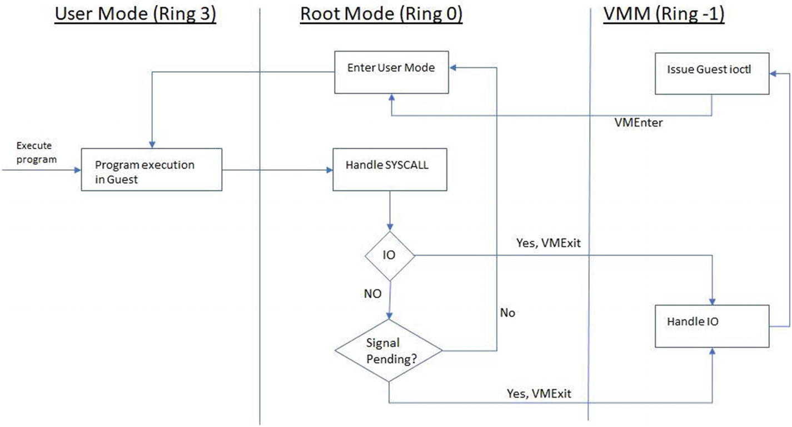
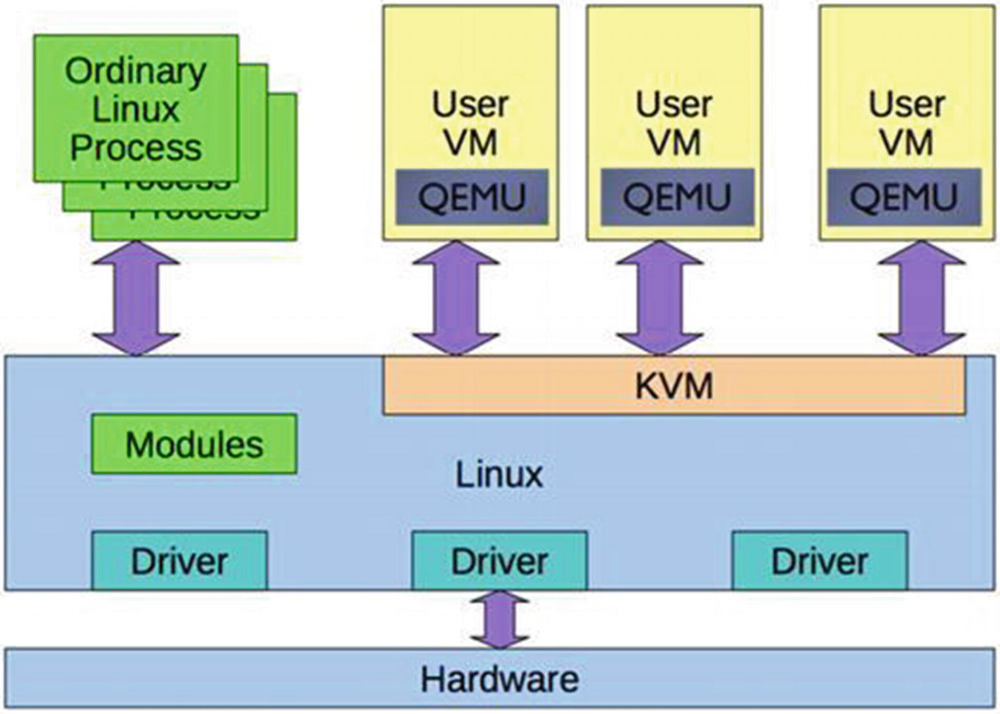
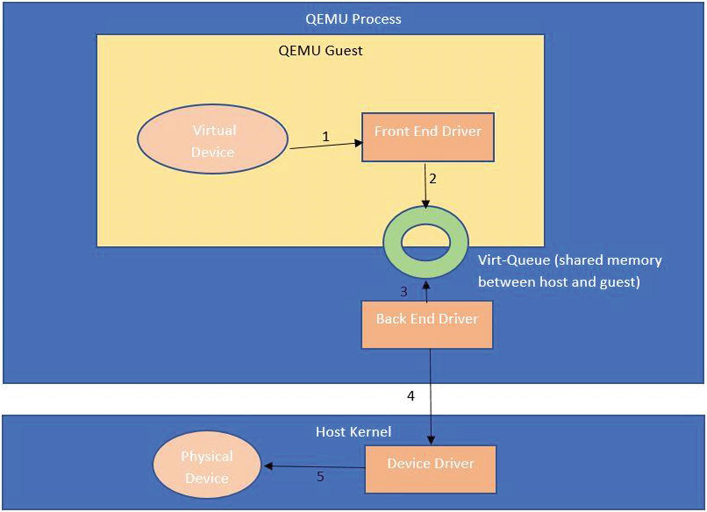
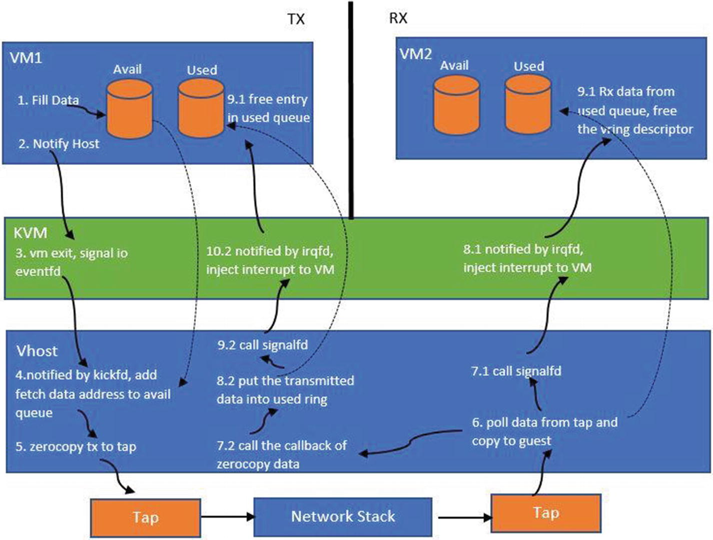
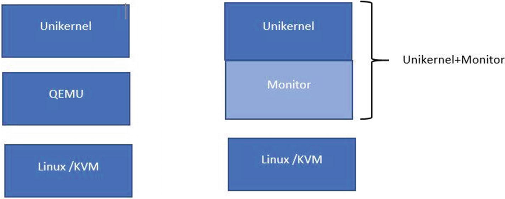
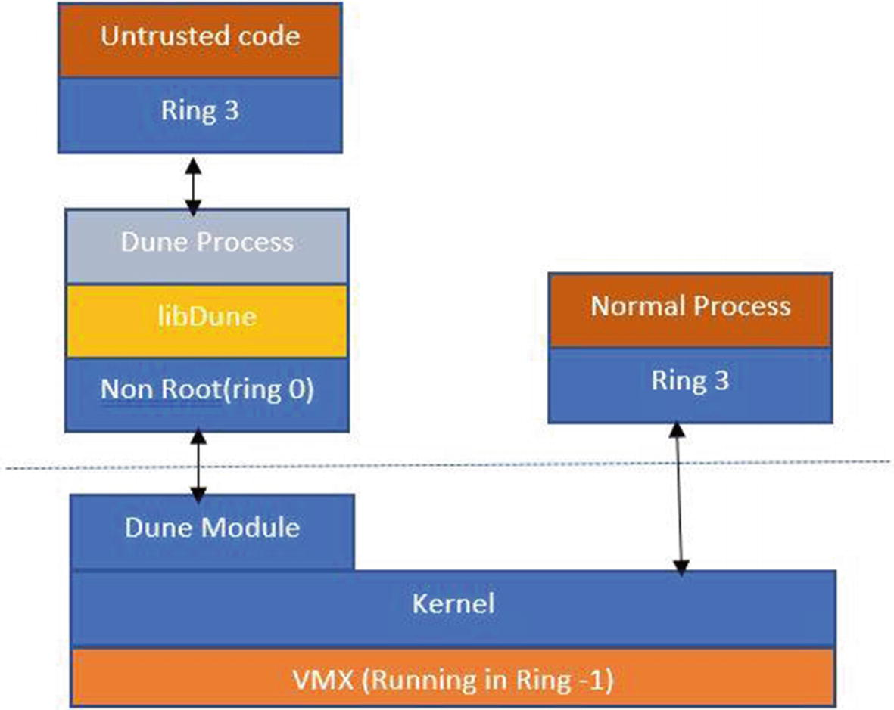

# Hypervisors
explains virtualization using components like the **Linux Kernel Virtual Machine (KVM)** and the **Quick Emulator (QEMU)**.
Based on these components, we then look at how VMs are created and how data flow between the guest and the hosts is 
facilitated.

Linux provides hypervisor facilities by using the QEMU(Quick Emulator) in the user space and a specialized kernel module called the 
KVM (the Linux Kernel Virtual Machine). The KVM uses the Intel vt-x extension instruction set to isolate resources at 
the hardware level. Since the QEMU is a user space process, the kernel treats it like other processes from a 
scheduling perspective.

## The Intel Vt-x Instruction Set
Intel’s virtualization technology (VT) comes in two flavors:
* Vt-x (for Intel x86 IA-32 and 64-bit architectures )
* Vt-i (for the Itanium processor line)

In the case of a virtual machine, to run the programs within the virtual machine, the guest OS translates program 
instructions into virtual CPU instructions and the hypervisor then converts these into instructions for the physical CPU.

In the case of a virtual machine, to run the programs within the virtual machine, the guest OS translates program 
instructions into virtual CPU instructions and the hypervisor then converts these into instructions for the physical CPU.

As we can see, for VM, the program instructions are translated twice—the program instructions are translated into 
virtual CPU instructions and the virtual CPU instructions are translated into physical CPU instructions.

This results in large performance overhead and slows down the virtual machine. CPU virtualization, like the vt-x 
feature, enables complete abstraction of the full prowess of the CPU to the virtual machine so that all the software 
in the VM can run without a performance hit; it runs as if it were on a dedicated CPU.

The vt-x also solves the problem whereby the x86 instructions architecture cannot be virtualized. According to the 
Popek Goldberg principle for virtualization (https://en.wikipedia.org/wiki/Popek_and_Goldberg_virtualization_requirements), 
all sensitive instructions must also be privileged. Privileged instructions cause a trap in user mode. In x86, some 
instructions are sensitive but not privileged. This means running them in the user space would not cause a trap. 
In effect, this means they are not virtualizable. An example of such an instruction is POPF.

vt-x simplifies the VMM software by closing virtualization holes by design:
* **Ring compression**: Prior to the introduction of vt-x, the guest OS would run in Ring 1 and the guest OS apps would run in Ring 3. To execute the privileged instructions in the guest OS, we need higher privileges, which are by default not available to the guest (due to security reasons). Therefore, to execute those instructions, we need to trap into the hypervisor (which runs in Ring 0 with more privileges), which can then execute the privileged instruction on behalf of the guest. This is called ring compression or deprivileging. vt-x avoids this by running the guest OS directly in Ring 0.

* **Non-trapping instructions**: Instructions like POPF on x86, which ideally should trap into the hypervisor as they are sensitive instructions, actually don’t trap. This is a problem as we need program control to shift to the hypervisor for all sensitive instructions. vt-x addresses this by running the guest OS in Ring 0, where instructions like POPF can trap into the hypervisor running in Ring -1.

* **Excessive trapping**: Without vt-x, all sensitive and privileged instructions trap into the hypervisor in Ring 0. With vt-x this becomes configurable and depends on the VMM as to which instructions cause a trap and which can be safely handled in Ring 0. Details of this are beyond the scope of this book.

vt-x adds two more modes—the non-root mode (in Ring -1) is where VMM runs and the root mode (in Ring 0) is where the guest OS runs.

To understand how these modes are involved in program execution, lets look at an example. Say that a program is being 
executed in VM and, during the course of its execution, it makes a system call for I/O. As discussed in the previous 
chapter, guest programs in user space are executed in Ring 3. When the program makes an I/O call (which is a system call), 
these instructions are executed at the guest OS kernel level (Ring 0). The guest OS by itself cannot handle I/O calls 
so it delegates them to the VMM (Ring -1). When the execution goes from Ring 0 to Ring -1, it’s called a **VMExit** and 
when the execution comes back from Ring -1 to Ring 0, it’s called a **VMEntry**. This is all shown in Figure 2-1.


## The Quick Emulator (QEMU)
The QEMU runs as a user process and handles the KVM kernel module. It uses the vt-x extensions to provide the guest 
with an isolated environment from a memory and CPU perspective. The QEMU process owns the guest RAM and is either 
memory mapped via a file or is anonymous. VCPUs are scheduled on the physical CPUs.

The main difference between a normal process and a QEMU process is the code executed on those threads. In the case of 
the guest, since it’s the virtualized machine, the code executes the software BIOS and the operating system.


The QEMU also dedicates a separate thread for I/O. This thread runs an event loop and is based on the non-blocking 
mechanism. It registers the file descriptors for I/O. The QEMU can use paravirtualized drivers like virtio to provide 
guests with virtio devices, such as virtio-blk for block devices and virtio-net for network devices. Figure 2-3 shows 
the specific components that facilitate communication between the guest and the host (hypervisor).


In Figure 2-3, you see that the guest within the QEMU process implements the frontend driver, whereas the host 
implements the backend drivers. The communication between frontend and backend driver happens over specialized 
data structures, called _virtqueues_. Any packet that originates from the guest is first put into the virtqueue and 
the host side driver is notified over a _hypercall_, to drain the packet for actual processing to the device. 
There can be two variations of this packet flow, as follows:
* The packet from the guest is received by the QEMU and then pushed to the backend driver on the host. One example is virtio-net.
* The packet from the guest directly reaches the host via what is called a vhost driver. This bypasses the QEMU layer and is relatively faster.

## Creating a VM Using the KVM Module
To create a VM, a set of ioctl calls has to be made to the kernel KVM module, which exposes a /dev/kvm device to the 
guest. In simplistic terms, these are the calls from the user space to create and launch a VM:
1. KVM CREATE VM: This command creates a new VM that has no virtual CPUs and no memory.
2. KVM SET USER MEMORY REGION: This command maps the user space memory for the VM.
3. KVM CREATE IRQCHIP / KVM CREATE VCPU: This command creates a hardware component like a virtual CPU and maps them with vt-x functionalities.
4. KVM SET REGS / SREGS / KVM SET FPU / KVM SET CPUID / KVM SET MSRS / KVM SET VCPU EVENTS / KVM SET LAPIC: These commands are hardware configurations.
5. KVM RUN: This command starts the VM.
notice this is nt related to kvm command defind in qemu package.
 ```shell
apt install qemu-system-x86
```

KVM RUN starts the VM and internally it’s the VMLaunch instruction invoked by the KVM kernel module that puts the VM 
code execution into non-root mode. It then changes the instruction pointer to the code location in the guest’s memory. 
This is a slight over-simplification, as the module does much more to set up the VM, including setting up the 
**VMCS(VM Control Section)**, and so on.

## Vhost Based Data Communication
Any discussion about hypervisors would be incomplete without showing a concrete example. We’ll look at an example of 
a network packet flow (depicted in Figure 2-4) in the context of the vhost-net device drivers. When we use the vhost 
mechanism, the QEMU is out of the data plane and there is direct communication between the guest and host over 
virtqueues. The QEMU remains in the control plane, where it sets up the vhost device on the kernel using the ioctl command:

/dev/vhost-net device

When the device is initialized, a kernel thread is created for the specific QEMU process. This thread handles the I/O 
for the specific guest. The thread listens to events on the host side, on the virtqueues. When an event arrives to 
drain the data (in virtio terminology, it’s called a kick), the I/O thread drains the packet from the tx (transmission)
queue of the guest. The thread then transmits this data to the tap device, which it makes it available to the 
underlying bridge/switch in order to transmit it downstream to an overlay or routing mechanism.

The KVM kernel module registers the **eventfd** for the guest. This a file descriptor that’s registered for the guest 
(by the QEMU) with the KVM kernel module. The FD is registered against a guest I/O exit event (a kick), which drains the data.



## What Is an eventfd?
So what basically is an eventfd? It’s an interprocess communication (IPC) mechanism that offers a wait-notify facility 
between user space programs or between the kernel and the user space. The idea is simple. In the same way that we have 
FDs for files, we can create **file descriptors for events**. The benefit here is that the FDs can then be treated like 
other FDs and can be registered with mechanisms like poll, select, and epoll. The mechanisms can then facilitate a 
notification system when those FDs are written to.

The consumer thread can be made to wait on an epoll object via epoll_wait . Once the producer thread writes to the FD, 
the epoll mechanism will notify the consumer (again depending on the edge or level triggers) of the event.

Edge-triggered means that you only get notified when the event is detected (which takes place, say in an instant), 
while level-triggered means you get notified when the event is present (which will be true over a period of time).

For example, in an edge-triggered system, if you want a notification to signal you when data is available to read, 
you’ll only get that notification when data was not available to read before, but now is. If you read some of the 
available data (so that some of the data is still available to read), you will not get another notification. If you 
read all of the available data, you will get another notification when new data becomes available to read again. 
In a level-triggered system, you’d get that notification whenever data is available to read.

The host uses an **eventfd** by using **ioeventfd** to send data from the guest to the host and **irqfd** to receive 
an interrupt from the host to the guest.

Another use case for eventfds is the out of **memory (OOM) cgroup**. The way this works is whenever the process 
exceeds the memcg limit, the OOM killer can decide to kill it or, if this behavior is disabled, 
the kernel can do the following
1. Create the eventfd.
2. Write the OOM event to the eventfd.

The process thread will block until the event is generated. Once the event is generated, the thread is woken up to 
react to the OOM notification.

The difference between eventfd and a Linux pipe is that the pipe needs two file descriptors, whereas eventfd just needs one.

The vhost I/O thread watches for the eventfd. Whenever the I/O event happens from the guest, the I/O thread for the 
guest gets informed that it has to drain the buffers from the tx queue.

Similar to ioeventfd, there is an irqfd. The QEMU user space also registers this (irqfd) FD for the guest. The guest 
driver listens for changes to those FDs. The reason for using this is to pass interrupts back to the guest to notify 
the guest side driver to process the packets. Taking the previous example, when the packets have to be sent back to 
the guest, the I/O thread fills up the rx queue (the receive queue) buffers for the guest and the interrupt injection 
is done to the guest via irqfd . In the reverse path of packet flow, the packets received on the host over the physical 
interface are put to the tap device. The thread that’s interfacing with the tap device receives the packets to fill up 
the rx buffers for the guest. It then notifies the guest driver over irqfds. See Figure 2-4.


## Alternative Virtualization Mechanisms
namespaces/cgroups-based mechanism we have with Docker

The motivation is to understand that it is possible to do the following:
* Reduce the interfaces exposed by different software layers like VMM in order to reduce attack vectors. The attack vectors can come in the form of exploits, like memory exploits that install malicious software or control the system by elevating privileges.
* Use hardware isolation to isolate the different containers/processes we run.

The VMM exposes the machine model (x86 interface), whereas the **container is exposing the POSIX interface**. The VMM, 
with hardware virtualization, can isolate CPU, memory, and I/O (vt-d, SRIOV, and IOMMU). **Containers that share the 
kernel provide this feature via namespaces and cgroups**, but are still considered a weaker alternative to the 
hardware-based isolation techniques.

### Unikernels
Unikernels provide the mechanism, via **toolchains**, for preparing a minimalistic OS. This means if the application only 
needs network APIs, then the keyboard, mouse devices, and their drivers are not packaged. This reduces the attack 
vector considerably.

One of the problems with unikernels was that they had to be built across different models of device drivers. With the 
advent of I/O virtualization and virtio drivers, this problem is somewhat resolved, as the unikernels can now be built 
with exact virtio devices and the drivers needed for the apps on the guest. This means the guest can be a unikernel 
(Library OS) sitting on top of, say, a hypervisor like KVM. This still has limitations, as the QEMU or the user space 
part still has a good amount of codebase, all of which are subject to exploits.

To achieve further minimalism, one proposal was to package the VMM alongside the unikernel. What this means is that 
VMM now plays the role of the QEMU for the unikernel, but per instance. The VMM code is limited to the needed 
functionality and facilitates memory-based communication between the guest and the VMM. With this model, multiple VMMs 
can be made to sit on the hypervisor. The VMM role facilitates I/O and creates the guest unikernel using the hardware 
isolation capabilities.


In Figure 2-5, we can observe that the image on the left is running a VMM and the QEMU combined, to run unikernels on 
top, whereas the image on the right shows a VMM (monitor) like UKVM packaged alongside the unikernel . So basically we 
have reduced the code (the QEMU) and thereby have eliminated a significant attack vector. This is in line with the 
minimalistic interfaces approach we talked about previously.

### Project Dune
A careful reader can easily make out that the vt-x isolation on the memory and CPU is not opinionated about running 
only a guest OS code in the guest’s memory. Technically, we can provision different sandboxing mechanisms on top of 
this hardware isolation. This is precisely what Project Dune is doing. On top of the hardware isolation of vt-x, **Dune 
doesn’t spin a guest OS, but a Linux process**. This means the process is made to run in **Ring 0** of the CPU and has 
the machine interface exposed to it. The process can be made to sandbox by:
1. Running the trusted code of the process in Ring 0. This is basically the library that Dune calls libdune.
2. Running the untrusted code in Ring 3.

The Dune architecture is shown in Figure 2-6.


To bootstrap the process, Dune creates an operating environment, which entails setting up the page tables 
(the CR3 register is pointing to the root). It also sets up the IDT for the hardware exceptions. The trusted and 
untrusted code runs in the same address space, wherein the memory pages of the trusted code are protected by supervisor 
bits in page table entries. The system calls trap into the same process and are interposed with hypercalls to the VMM.
For more details on Dune, check out http://dune.scs.stanford.edu/.

### novm
novm is another type of hardware container used by the project. (It also uses the KVM APIs to create the VM via using 
the /dev/kvm device file.) Instead of presenting a disk interface to the VM, novm presents a file system (9p) interface 
back to the VM. This allows packaging of software that we want to provision as a container. There is no BIOS and the 
VMM simply puts the VM in 32-bit protected mode directly. This makes the provisioning process faster, because steps 
like device probing are not needed.


