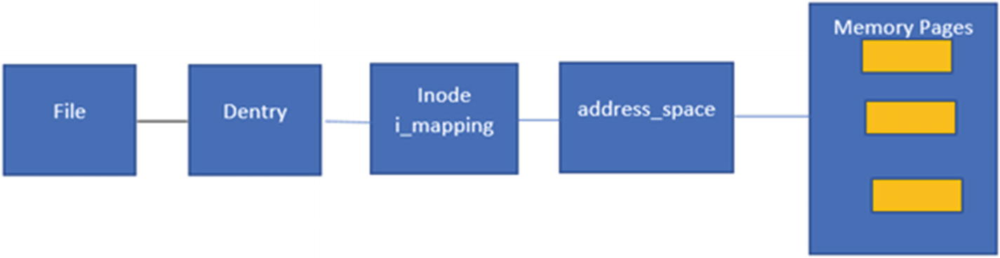
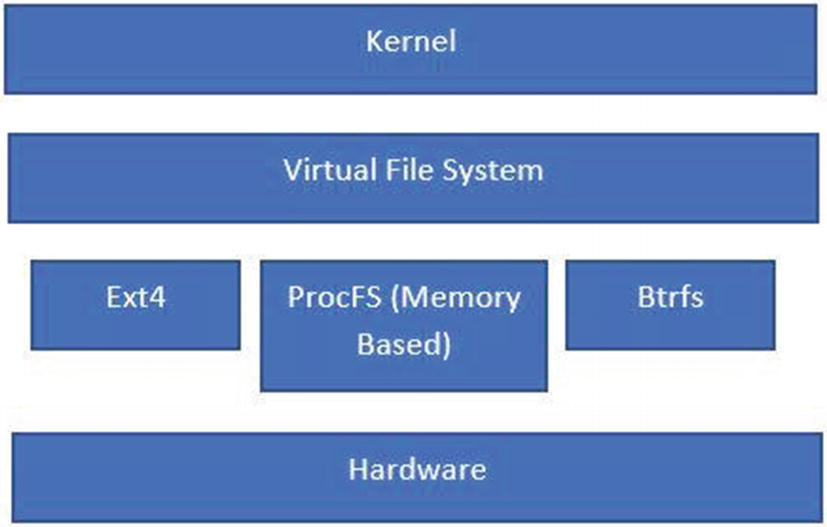
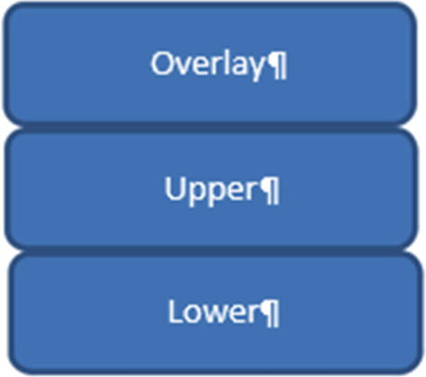

# Layered File Systems
We discuss how it enables file-sharing on the host and how this helps run multiple containers on the host.

## A File System Primer
The Linux philosophy is to treat everything as a file. As an example, socket, pipe, and block devices are all represented as files in Linux.

The file systems in Linux act as containers to abstract the underlying storage in the case of block devices. For 
non-block devices like sockets and pipes, there are file systems in memory that have operations which can be invoked 
using the standard file system API.

Linux abstracts all file systems using a layer called the **Virtual File System (VFS)**. All file systems register 
with the VFS. The VFS has the following important data structures:
* File: This represents the open file and captures the information, like offset, and so on. The user space has a 
handle to an opened file via a structure called the file descriptor. This is the handle used to interface with the file system.
* Inode: This is mapped 1:1 to the file. The inode is one of the most critical structures and holds the metadata about
the file. As an example, it includes in which **data blocks** the file data is stored and which **access permissions** are on 
the file. This info is part of the inode. Inodes are also stored on disk by the specific file system, but there is a 
representation in memory that’s part of the VFS layer. The file system is responsible for enumerating the VFS inode structure.
* Dentry: This is the mapping between filename and inode. This is an **in-memory** structure and is not stored on disk. 
This is mainly relevant to lookup and path traversal.
* Superblock: This structure holds all the information about the file system, including how many blocks are there, 
* the device name, and so on. This structure is enumerated and brought into memory during a mount operation.

Each of these data structures holds pointers to their specific operations. As an example, file has **file_ops** for 
reading and writing and superblock has operations via **super_ops** to mount, unmount, and so on.

The mount operation creates a **vfsmount** data structure, which holds a reference to a new superblock structure 
created from the file system to be mounted on the disk. The **dentry** has a reference to the **vfsmount**. This is 
where the VFS distinguishes between a directory and a mount point. During a traversal, the **vfsmount** is found in 
a dentry, the inode number 2 on the mounted device is used (inode 2 is reserved for the root directory).

So how does this all fit together in the case of a block device? Say that the user space process makes a call to read 
a file. The system call is made to the kernel. The VFS checks the path and determines if there are **dentries** cached 
from the root. As it traverses and finds the right dentry, it locates the inode for the file to be opened. Once the 
inode is located, the permissions are checked and the data blocks are loaded from the disk into the OS page cache. 
The same data is moved into the user space of the process.

The page cache is an interesting optimization in the OS. All reads and writes (except direct I/O) happen over the 
page cache. The page cache itself is represented by a data structure called the **address_space**. This address_space 
holds a tree of memory pages and the file inode holds a reference to that address_space data structure.

Figure 5-1 shows how a file maps into the page cache. This is also the key to understanding how operations like 
**mmap** for memory mapped files work. We will cover that when we cover file systems like **tmpfs** and shared memory 
IPC primitives.


If the file read request is in the page cache (which is determined via the address_space structure of the file’s inode), 
the data is served from there.

Whenever a write call is made on the file via the file descriptor, the writes are first written to the page cache. 
The memory pages are marked dirty and the Linux kernel uses the **write-back** cache mechanism, which means there are 
threads in the background (called **pdflush**) that drain the page cache and write to the physical disk via the 
block driver. The mechanism of marking pages dirty doesn’t happen at the page level. Pages can be **4KB** in size and 
even a minimal change will then cause a full page write.

To avoid that, there are structures that have more **fine-grained** granularity and represent a disk block in memory. 
These structures are called buffer heads . For example, if the block size is 512 bytes, there are eight buffer heads 
and one page in the page cache.

That way, individual blocks can be marked dirty and made part of the writes.

The buffers can be explicitly flushed to disk via these system calls:
* Sync(): Flushes all dirty buffers to disk.
* Fsync(fd): Flushes only the file-specific dirty buffers to disk, including the changes to inode.
* Fdatasync(fd): Flushes only the dirty data buffers of the file to disk. Doesn’t flush the inodes.

Here’s an example of how this sync process works:
1. Check if the superblock is dirty.
2. Write back the superblock.
3. Iterate over each inode from the inode list:

a. If the inode is dirty, write it back.

b. If the page cache of the inode is dirty, write it back.

c. Clear the dirty flag.

Figure 5-2 shows the file system’s different layers under the kernel.


Examples of different kinds of file systems include:
* Ext4: This file system is used to access the underlying block devices.
* ProcFS: This is an in-memory file system and is used to provide features. This is also called a pseudo file system .

## A Few Words on Pseudo File Systems
Recall that the general philosophy of Linux is that everything is a file. Working on that premise, there are file 
systems that expose some of the kernel’s resources over the file interface. We call them **pseudo file systems**. 
One such file system is **procfs**.

The **procfs** file system is mounted on the **rootfs** under the **proc** directory. The data under **procfs** is not 
persisted and all operations happen in memory.

Some of the structures exposed via procfs are explained in the following table:

| Structure  |  Description |
|---|---|
| /proc/cpuinfo  | CPU details like cores, CPU size, make, etc.  |
| /proc/meminfo  | Information about physical memory  |
| /proc/interrupts  | Information about interrupts and handlers  |
| /proc/vmstat  | Virtual memory stats  |
| /proc/filesystems  | Active file systems on the kernel  |
| /proc/mounts  | Current mounts and devices; this will be specific to the mount namespace  |
| /proc/uptime  | Time since the kernel was up  |
| /proc/stat  | System statistics  |
| /proc/net  | Network-related structures like TCP sockets, files, etc. proc also exposes some process-specific information via files  |
| /proc/pid/cmdline  | Command-line name of the process  |
| /proc/pid/environ  | Environment variables of the process  |
| /proc/pid/mem  | Virtual memory of the process  |
| /proc/pid/maps  | Mapping of the virtual memory  |
| /proc/pid/fdinfo  | Open file descriptors of the process  |
| /proc/pid/task  | Details of the child processes  |

## Layered File Systems
The layered file system allows files to be shared on disk, thereby saving space. Since these files are shared in 
memory (loaded in page cache), a layered file system allows optimal space utilization as well as faster bootup.

Consider an example of running ten Cassandra databases on the same host, each database running its own namespaces. If 
we have separate file systems for each database’s different inodes, we don’t enjoy these advantages:
* Memory sharing
* Sharing on disk

Whereas in the case of a layered file system, the file system is broken into layers and each layer is a read-only 
file system. Since these layers are shared across the containers on the same host, they tend to use storage optimally. 
And, since the inodes are the same, they refer to the same OS page cache. This makes things optimal from all aspects.

Compare this to VM-based provisioning, where each **rootfs** is provisioned as a disk. This means they all have 
different inode representations on the host and there is no optimal storage as compared to the containers.

**Hypervisors** also tend to reach optimization using techniques like **KSM (Kernel Same Page Merging)** so they can 
de-duplicate across VMs for the same pages.


## The Union File System
According to Wikipedia, the union file system is a file system service for Linux, FreeBSD, and NetBSD that implements 
a union mount for other file systems. It allows files and directories of separate file systems, known as branches , 
to be transparently overlaid, forming a single coherent file system. The contents of any directories that have the 
same path within the merged branches will be seen together in a single merged directory, within the new virtual file 
system.

So basically, a union file system allows you to take different file systems and create a union of their contents, 
with the top layer providing a view of all the files underlying it. If duplicate files are found, the top layer 
supersedes the layers below it.

## OverlayFS
This section looks at OverlayFS as one example of a union FS. OverlayFS has been part of the Linux Kernel since 3.18. 
It overlays (as the name suggests) the contents of one directory onto other. The source directories can be on 
different disks or file systems.

With OverlayFS v1, there were only two layers, and they were used to create a unified layer, as shown in Figure 5-3.


OverlayFS v2 has three layers:

* Base: This is the base layer. This is primarily read-only.
* Overlay: This layer provides visibility from the base layer and allows one to add new files/directories. If any 
files from the base layer change, they are stored in the next layer.
* Diff: The changes made in the overlay layer are stored in the diff layer. Any changes to files in the base layer 
lead to copying the file from the base layer to the diff layer. The changes are then written in the diff layer.

### example
```shell
sudo su
mkdir todel
cd todel
mkdir base diff overlay workdir
echo "test data" > base/test1
mount \
-t overlay \
-o lowerdir=base,upperdir=diff,workdir=workdir \
overlay \
overlay

touch overlay/test2
ls overlay/
echo you should see test1 and test2

ls diff/
echo you should see test2

# let us modify test1
echo "modified test data" >> overlay/test1
cat diff/test1
echo you should see the modified data

# clean up
umount overlay
cd ..
rm -dr todel
```

### docker
Lets now think about how container engines like Docker implement this process. There is an **Overlay2 storage driver** 
in Docker, which you can find out more about at https://github.com/moby/moby/blob/master/daemon/graphdriver/overlay2/overlay.go.

Docker creates multiple read layers (base layers) and one read/write layer called the container layer (in our case, the overlay layer).

The multiple read layers can be shared across different containers on the same host, thereby attaining very 
high optimization. As hinted at earlier, since we have the same file system and the same inodes, the OS page cache is 
also shared across all containers on the same host.

Contrary to this, if we see a Docker driver device mapper, since it gives a virtual disk for each layer, we might 
not experience the sharing we get with OverlayFS .But now, even with the device mapper usage in Docker, we can 
pass the –shared-rootfs option to the daemon to share the rootfs. This basically works by creating a device for 
the first container base image and then doing bind mounts for subsequent containers. The bind mounts allow us to 
preserve the same inodes and therefore the page cache is shared.


