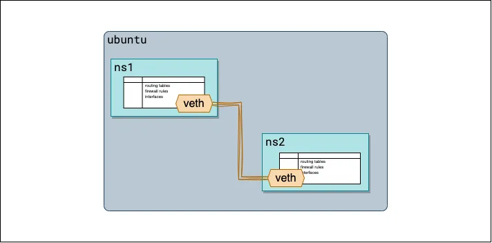

# Namespaces
Namespaces allow the kernel to provide isolation by restricting the visibility of the kernel resources like 
mountpoints, network subsystems among processes scoped to different namespaces. Examples of such namespace visibilities 
are mount points and network subsystems.

Linux containers are made of three Linux kernel primitives:
* Linux namespaces
* cgroups
* Layered file systems

A **namespace** is a logical isolation within the Linux kernel. A namespace controls visibility within the kernel. All 
the controls are defined at the process level. **That means a namespace controls which resources within the kernel a 
process can see**. Think of the Linux kernel as a guard protecting resources like OS memory, privileged CPU 
instructions, disks, and other resources that only kernel should be able to access. Applications running within user 
space should only access these resources via a trap, in which case the kernel takes over control and executes these 
instructions on behalf of the user space application. As an example, an application that wants to access a file on a 
disk will have to delegate this call to the kernel via a system call (which internally traps into the kernel) to the 
Linux kernel, which then executes this request on behalf of the application.

Since there could be many user space applications running in parallel on a single Linux kernel, we need a way to 
provide isolation between these user space-based applications. By isolation, we mean that there should be a kind of 
sandboxing of the individual application, so that certain resources in the application are confined to that sandbox. 
As an example, we would like to have file system sandbox, which would mean that within that sandbox, we could have our 
own view of the files. That way, multiple such sandboxes could be run over the same Linux kernel without interfering 
with each other.

The technique to achieve such sandboxing is done by a specific data structure in the Linux kernel, called the **namespace**.

## Namespace Types
In this section, we explain the different namespaces that exist within the Linux kernel and discuss how they are realized within the kernel.

### UTS
This namespace allows a process to see a separate hostname other than the actual global namespace one.

### PID
The processes within the PID namespace have a different process tree. They have an init process with **PID 1**. At the 
data structure level though, the processes belong to one global process tree, which is visible only at the host level. 
Tools like ps or direct usage of the /proc file system from within the namespace will list the processes and their 
related resources for the process tree within the namespace.

## Mount
This is one of the most important namespaces. It controls which mount points a process should see. If a process is 
within a namespace, it will only see the mounts within that namespace.

A small detour might be of help to explain how mount propagation works with containers. A mount in the kernel is 
represented by a data structure called **vfsmount**. All mounts form a tree-like structure, with a child mount 
structure holding a reference to the parent mount structure.
```
struct vfsmount {
      struct list_head mnt_hash;
      struct vfsmount *mnt_parent;    /* fs we are mounted on */
      struct dentry *mnt_mountpoint;  /* dentry of mountpoint */
      struct dentry *mnt_root;      /* root of the mounted tree*/
      struct super_block *mnt_sb;     /* pointer to superblock */
      struct list_head mnt_mounts;  /* list of children,
                                       anchored here */
      struct list_head mnt_child;     /* and going through their
                                       mnt_child */
      atomic_t mnt_count;
      int mnt_flags;
      char *mnt_devname;              /* Name of device e.g.
                                         /dev/dsk/hda1 */
      struct list_head mnt_list;
};
```

Whenever a mount operation is invoked, a **vfsmount** structure is created and the dentry of the mount point as well as 
the dentry of the mounted tree is populated. A dentry is a data structure that maps the inode to the filename.

Apart from mount, there is a bind mount, which allows a directory (instead of a device) to be mounted at a mount point. 
The process of bind mounting results in creating a vfsmount structure that points to the dentry of the directory.

Containers work on the concept of bind mounts. So, when a volume is created for a container, it’s actually a bind mount 
of a directory within the host to a mount point within the container’s file system. Since the mount happens within the 
mount namespace, the vfsmount structures are scoped to the mount namespace. This means that, by creating a bind mount 
of a directory, we can expose a volume within the namespace that’s holding the container.

### Network
A network namespace gives a container a separate set of network subsystems. This means that the process within the 
network namespace will see different network interfaces, routes, and iptables. This separates the container network 
from the host network. We will study this in more depth when we look at an example of the packet flow between two 
containers in different namespaces on the same host as well as containers in different namespaces within the same host.

### IPC
This namespace scopes IPC constructs such as POSIX message queues. Between two processes within the same namespace, IPC 
is enabled, but it will be restricted if two processes in two different namespaces try to communicate over IPC.

### Cgroup
This namespace restricts the visibility of the cgroup file system to the cgroup the process belongs to. Without this 
restriction, a process could peek at the global cgroups via the **/proc/self/cgroup** hierarchy. This namespace 
effectively virtualizes the cgroup itself.

### Time
The time namespace has two main use cases:
* Changes the date and time inside a container
* Adjusts the clocks for a container restored from a checkpoint

The kernel provides access to several clocks: _CLOCK_REALTIME_, _CLOCK_MONOTONIC_, and _CLOCK_BOOTTIME_. The last two 
clocks are monotonous, but the start points for them are not well defined (currently it is system startup time, but 
the POSIX says “since an unspecified point in the past”) and are different for each system. When a container migrates 
from one node to another, all the clocks are restored to their consistent states. In other words, they have to continue 
running from the same point where they were dumped.

## Namespace datastructures
The kernel represents each process as a _task_struct_ data structure. If we detail this structure and list some of its 
members, we see the following:
```
/* task_struct member predeclarations (sorted alphabetically): */
struct audit_context;
struct backing_dev_info;
struct bio_list;
struct blk_plug;
struct capture_control;
struct cfs_rq;
struct fs_struct;
struct futex_pi_state;
struct io_context;
struct mempolicy;
struct nameidata;
struct nsproxy;
struct perf_event_context;
struct pid_namespace;
struct pipe_inode_info;
struct rcu_node;
struct reclaim_state;
struct robust_list_head;
struct root_domain;
struct rq;
struct sched_attr;
struct sched_param;
struct seq_file;
struct sighand_struct;
struct signal_struct;
struct task_delay_info;
struct task_group;
```

### nsproxy
The nsproxy structure is a holder structure for the different namespaces that a task (process) belongs to.
```
struct nsproxy {
       atomic_t count;
       struct uts_namespace *uts_ns;
       struct ipc_namespace *ipc_ns;
       struct mnt_namespace *mnt_ns;
       struct pid_namespace *pid_ns_for_children;
       struct net           *net_ns;
       struct time_namespace *time_ns;
       struct time_namespace *time_ns_for_children;
       struct cgroup_namespace *cgroup_ns;
};
extern struct nsproxy init_nsproxy;
```
The nsproxy holds the eight namespace data structures. The missing one is the user namespace, which is part of the 
cred data structure in the task_struct.

There are three system calls that can be used to put tasks into specific namespaces. These are _clone_, _unshare_, and 
_setns_. The clone and setns calls result in creating a nsproxy object and then adding the specific namespaces needed 
for the task.

##  net
A network namespace is represented by a net structure. Part of that data structure is shown here:
```
struct net {
       /* First cache line can be often dirtied.
        * Do not place read-mostly fields here.
        */
       refcount_t           passive;       /* To decide when the network
                                           * namespace should be freed.
                                           */
       refcount_t           count;        /* To decided when the network
                                           *  namespace should be shut down.
                                           */
       spinlock_t           rules_mod_lock;
       unsigned int         dev_unreg_count


;
       unsigned int         dev_base_seq;   /* protected by rtnl_mutex */
       int                  ifindex;
       spinlock_t          nsid_lock;
       atomic_t            fnhe_genid;
       struct list_head    list;            /* list of network namespaces */
       struct list_head    exit_list;       /* To linked to call pernet exit
                                            * methods on dead net (
                                            * pernet_ops_rwsem read locked),
                                            * or to unregister pernet ops
                                            * (pernet_ops_rwsem write locked).
                                            */
       struct llist_node   cleanup_list;   /* namespaces on death row */
#ifdef CONFIG_KEYS


       struct key_tag          *key_domain; /* Key domain of operation tag */
#endif
       struct user_namespace   *user_ns;    /* Owning user namespace */
       struct ucounts           *ucounts;
       struct idr               netns_ids;
       struct ns_common    ns;
       struct list_head    dev_base_head;
       struct proc_dir_entry    *proc_net;
       struct proc_dir_entry    *proc_net_stat;
#ifdef CONFIG_SYSCTL
       struct ctl_table_set      sysctls;
#endif
       struct sock            *rtnl;        /* rtnetlink socket */
       struct sock            *genl_sock;
       struct uevent_sock     *uevent_sock;  /* uevent socket */
       struct hlist_head      *dev_name_head;
       struct hlist_head      *dev_index_head;
       struct raw_notifier_head     netdev_chain;
```
One of the elements of this data structure is the _user_ namespace to which this network namespace belongs. Apart from 
that, the major structural part of this is _net_ns_ipv4_, which includes the **routing table, net filter rules, and so on**.

```shell
struct netns_ipv4 {
#ifdef CONFIG_SYSCTL
      struct ctl_table_header    *forw_hdr;
      struct ctl_table_header    *frags_hdr;
      struct ctl_table_header    *ipv4_hdr;
      struct ctl_table_header    *route_hdr;
      struct ctl_table_header    *xfrm4_hdr;
#endif
      struct ipv4_devconf        *devconf_all;
      struct ipv4_devconf        *devconf_dflt;
      struct ip_ra_chain __rcu *ra_chain;
      struct mutex         ra_mutex;
#ifdef CONFIG_IP_MULTIPLE_TABLES
      struct fib_rules_ops  *rules_ops;
      bool                       fib_has_custom_rules;
      unsigned int               fib_rules_require_fldissect;
      struct fib_table __rcu    *fib_main;
      struct fib_table __rcu    *fib_default;
#endif
      bool                  fib_has_custom_local_routes;
#ifdef CONFIG_IP_ROUTE_CLASSID
      Int                   fib_num_tclassid_users;
#endif
      struct hlist_head    *fib_table_hash;
      bool                  fib_offload_disabled;
      struct sock          *fibnl;
      struct sock  * __percpu    *icmp_sk;
      struct sock         *mc_autojoin_sk;
      struct inet_peer_base      *peers;
      struct sock  * __percpu    *tcp_sk;
      struct fqdir         *fqdir;
#ifdef CONFIG_NETFILTER
      struct xt_table      *iptable_filter;
      struct xt_table      *iptable_mangle;
      struct xt_table      *iptable_raw;
      struct xt_table      *arptable_filter;
#ifdef CONFIG_SECURITY
      struct xt_table      *iptable_security;
#endif
      struct xt_table      *nat_table;
#endif
      int sysctl_icmp_echo_ignore_all;
      int sysctl_icmp_echo_ignore_broadcasts;
      int sysctl_icmp_ignore_bogus_error_responses;
      int sysctl_icmp_ratelimit;
      int sysctl_icmp_ratemask;
      int sysctl_icmp_errors_use_inbound_ifaddr;
      struct local_ports ip_local_ports;
      int sysctl_tcp_ecn


;
      int sysctl_tcp_ecn_fallback;
      int sysctl_ip_default_ttl;
      int sysctl_ip_no_pmtu_disc;
      int sysctl_ip_fwd_use_pmtu;
      int sysctl_ip_fwd_update_priority;
      int sysctl_ip_nonlocal_bind;
      int sysctl_ip_autobind_reuse;
      /* Shall we try to damage output packets if routing dev changes? */
      int sysctl_ip_dynaddr;
```

This is how the iptables and routing rules are all scoped into the network namespace.

Other data structures of relevance here are the net_device (this is how the kernel represents the network card/device) 
and sock (a kernel representation of a socket data structure). These two structures allow the device to be scoped into 
a network namespace as well as the socket to be scoped to the namespace. Both these structures can be part of only one
namespace at a time. We can move the device to a different namespaces via the iproute2 utility .

## Namespace commands
Here are some of the user space commands to handle the network namespaces:
* **ip netns add testns**: Adds a network namespace
* **ip netns del testns**: Deletes the mentioned namespace
* **ip netns exec testns sh**: Executes a shell within the testns namespace

### Adding a Device to a Namespace
First, create a veth pair device (this device can be used to join two namespaces):
ip link add veth0 type veth peer name veth1
Then add one end of the veth pair to the network namespace testns:
ip link set veth1 netns testns
The other end (veth0) is in the host namespace and so any traffic sent to veth0 ends up on veth1 in the testns namespace.

Assume that we run an HTTP server in the testns namespace, which means the listener socket is scoped to the testns 
namespace, as explained previously in the sock data structure. So a TCP packet to be delivered to the IP and port of 
the application within the testns namespace would be delivered to the socket scoped within that namespace.

### veth
Veth devices, short for virtual Ethernet devices, are **pairs of virtual network interfaces that are used to connect 
network namespaces together**. Each pair consists of two ends: one end resides in one namespace, while the other end 
resides in another. These virtual interfaces behave like Ethernet cables, facilitating communication between the 
connected namespaces. Traffic can tunnel through this veth pair in two way.


[veth](https://medium.com/@amazingandyyy/introduction-to-network-namespaces-and-virtual-ethernet-veth-devices-304e0c02d084)
### example

```shell
sudo su
# create two namespaces
ip netns add ns1
ip netns add ns2
echo namespaces you skould see ns1 and ns2 
ip netns

# create veth
ip link add veth1 type veth peer name veth2
# see the veth devices
echo veth you should see veth1 and veth2
ip a | grep veth

# configure namespace ns1
ip link set veth1 netns ns1
ip netns exec ns1 ip link set dev veth1 up
echo you should see veth1 interface
ip netns exec ns1 ip a

# configure namespace ns2
ip link set veth2 netns ns2
ip netns exec ns2 ip link set dev veth2 up
echo you should see veth2 interface
ip netns exec ns2 ip a

# configure ip address on ns1 
ip netns exec ns1 ip addr add 192.168.1.1/24 dev veth1 && ip netns exec ns1 ip link set dev veth1 up
echo you should see 192.168.1.1 on veth1
ip netns exec ns1 ip a

# configure ip address on ns2
ip netns exec ns2 ip addr add 192.168.1.2/24 dev veth2 && sudo ip netns exec ns2 ip link set dev veth2 up
echo you should see 192.168.1.2 on veth2
ip netns exec ns2 ip a

# ns1 pings 192.168.1.2
ip netns exec ns1 ping -c 3 192.168.1.2

# ns2 pings 192.168.1.1
ip netns exec ns2 ping -c 3 192.168.1.1

# cleanup
ip netns delete ns1
ip netns delete ns2

```


