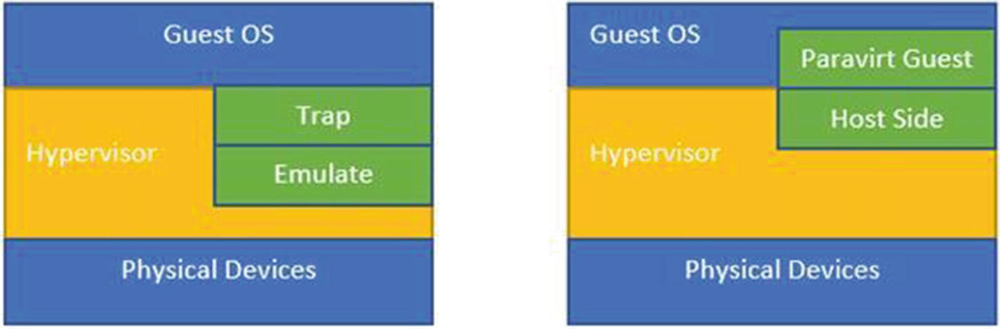

# Containers and Virtualization
[Linux Containers and Virtualization: A Kernel Perspective](https://learning.oreilly.com/library/view/linux-containers-and/9781484262832/)

[Hypervisors](Hypervisors.md)
[Namespaces](Namespaces.md)
[Cgroups](Cgroups.md)
[Layered File Systems](LayeredFileSystems.md)

## Introduction
Virtualization provides abstraction on top of the actual resources we want to virtualize. The level at which this 
abstraction is applied changes the way that different virtualization techniques look.

At a higher level, there are two major virtualization techniques based on the level of abstraction.
* Virtual machine (VM)-based
* Container-based
* unikernels

unikernels , which are lightweight single-purpose VMs. IBM is currently attempting to run unikernels as processes with 
projects like Nabla. In this book, we will mainly look at VM-based and container-based virtualizations only.

## Hypervisors
A special piece of software is used to virtualize the OS, called the hypervisor. The hypervisor itself has two parts:
* Virtual Machine Monitor (VMM): Used for trapping and emulating the privileged instruction set (which only the kernel 
of the operating system can perform).
* Device model: Used for virtualizing the I/O devices.

### Virtual Machine Monitor (VMM)
Since the hardware is not available directly on a virtual machine (although in some cases it can be), the VMM traps 
privileged instructions that access the hardware (like disk/network card) and executes these instructions on behalf 
of the virtual machine.

The VMM has to satisfy three properties (Popek and Goldberg, 1973):
* Isolation: Should isolate guests (VMs) from each other.
* Equivalency: Should behave the same, with or without virtualization. This means we run the majority (almost all) of the instructions on the physical hardware without any translation, and so on.
* Performance: Should perform as good as it does without any virtualization. This again means that the overhead of running a VM is minimal.

Some of the common functionalities of the VMM are as follows:
* Does not allow the VM to access privileged states; that is, things like manipulating the state of certain host registers should not be allowed from the VM. The VMM will always trap and emulate those calls.
* Handles exceptions and interrupts. If a network call (i.e., a request) was issued from within a virtual machine, it will be trapped in the VMM and emulated. On receipt of a response over the physical network/NIC, the CPU will generate an interrupt and deliver it to the actual virtual machine that it’s addressed to.
* Handles CPU virtualization by running the majority of the instructions natively (within the virtual CPU of the VM) and only trapping for certain privileged instructions. This means the performance is almost as good as native code running directly on the hardware.
* Handles memory mapped I/O by mapping the calls to the virtual device-mapped memory in the guest to the actual physical device-mapped memory. For this, the VMM should control the physical memory mappings (Guest Physical memory to Host Physical memory).

### Device Model
The device model of the hypervisor handles the I/O virtualization again by trapping and emulating and then delivering 
interrupts back to the specific virtual machine.

## Memory Virtualization
In the case of virtualization, the guest OS cannot be given direct access to the physical memory. What this means is 
that the guest OS should not be able to manipulate the hardware page tables, as this can lead to the guest taking 
control of the physical system.

The OS provides its processes a virtual view of memory; any access to the physical memory is intercepted and handled 
by the hardware component called the **Memory Management Unit (MMU)**. The OS sets up the **CR3** register 
(via a privileged instruction) and the MMU uses this entry to walk the page tables to determine the physical mapping. 
The OS also takes care of changing these mappings when allocation and deallocation of physical memory happens.

Now, in the case of virtualized guests, the behavior should be similar. The guest should not get direct access to the 
physical memory, but should be intercepted and handled by the VMM.

Basically, there are three memory abstractions involved when running a guest OS:
* Guest Virtual memory: This is what the process running on the guest OS sees.
* Guest Physical memory: This is what the guest OS sees.
* System Physical memory: This is what the VMM sees.

There are two possible approaches to handle this:
* Shadow page tables
* Nested page tables with hardware support

### Shadow Page Tables
the Guest Virtual memory is mapped directly to the System Physical memory via the VMM. This improves performance by 
avoiding one additional layer of translation. But this approach has a drawback. When there is a change to the guest 
page tables, the shadow page tables need to be updated. This means there has to be a trap and emulation into the VMM 
to handle this. The VMM can do this by marking the guest page tables as read-only. That way, any attempt by the guest 
OS to write to them causes a trap and the VMM can then update the shadow tables.

### Nested Page Tables with Hardware Support
Intel and AMD provided a solution to this problem via hardware extensions. Intel provides something called an 
**Extended Page Table (EPT)**, which allows the MMU to walk two page tables.

The first walk is from the Guest Virtual to the Guest Physical memory and the second walk is from the Guest Physical 
to the System Physical memory. Since all this translation now happens in the hardware, there is no need to maintain 
shadow page tables. Guest page tables are maintained by the guest OS and the other page table is maintained by the VMM.

With shadow page tables, the TLB cache (translation look-aside buffer, which is part of MMU) needs to be flushed on 
a context switch, that is, bringing up another VM. Whereas, in the case of an EPT, the hardware introduces a VM 
identifier via the address space identifier, which means TLB can have mappings for different VMs at the same time, 
which is a performance boost.

## CPU Virtualization
The x86 architecture uses the concept of protection rings. The kernel runs in the most privileged mode, Ring 0, and 
the user space used for running processes run is in Ring 3.

The hardware requires that all privileged instructions be executed in Ring 0. If any attempt is made to run a 
privileged instruction in Ring 3, the CPU generates a fault. The kernel has registered fault handlers and, based on 
the fault type, a fault handler is invoked. The corresponding fault handler does a sanity check on the fault and 
processes it. If a sanity check passes, the fault handler handles the execution on behalf of the process. In the case 
of VM-based virtualization, the VM is run as a process on the host OS, so if a fault is not handled, the whole VM 
could be killed.

At a high-level, privilege instruction execution from Ring 3 is controlled by a code segment register via the 
**CPL (code privilege level)** bit. All calls from Ring 3 are gated to Ring 0. As an example, a system call can be 
made by an instruction like syscall (from user space), which in turn sets the right CPL level and executes the kernel 
code with a higher privilege level. Any attempt to directly call high-privilege code from upper rings leads to a 
hardware fault.

The same concept applies to a virtualized OS. In this case, the guest is deprivileged and runs in Ring 1 and the 
process of the guest runs in Ring 3. The VMM itself runs in Ring 0. With fully virtualized guests, any privileged 
instruction has to be trapped and emulated. The VMM emulates the trapped instruction. Over and above the privileged 
instructions, the sensitive instructions also need to be trapped and emulated by the VMM.

## IO Virtualization
There are generally two modes of IO virtualization:
* Full virtualization
* Paravirtualization

### Full Virtualization
With full virtualization, the guest does not know it’s running on a hypervisor and the guest O/S doesn’t need any 
changes to run on a hypervisor. Whenever the guest makes I/O calls, they are trapped on the hypervisor and the 
hypervisor performs the I/O on the physical device.

### Paravirtualization
In this case, the guest OS is made aware that it’s running in a virtualized environment and special drivers are loaded 
into the guest to take care of the I/O. The system calls for I/O are replaced with hypercalls.

With the paravirtualized scenario, the guest-side drivers are called the frontend drivers and the host-side drivers 
are called the backend drivers. **Virtio** is the virtualization standard for implementing paravirtualized drivers. 
The frontend network or I/O drivers of the guest are implemented based on the Virtio standard and the frontend drivers 
are aware that they are running in a virtual environment. They work in tandem with the backend Virtio drivers of the 
hypervisor. This working mechanism of frontend and backend drivers helps achieve high-performance network and disk 
operations and is the reason for most of the performance benefits enjoyed by paravirtualization.

As mentioned, the frontend drivers on the guests implement a common set of interfaces, as described by the 
Virtio standard. When an I/O call has to be made from the process in the guest, the process invokes the frontend 
driver API and the driver passes the data packets to the corresponding backend driver through the 
**virtqueue (the virtual queue)**.

The backend drivers can work in two ways:
* They can use QEMU emulation, which means the QEMU emulates the device call via system calls from the user space. This means that hypervisor lets the user space QEMU program make the actual device calls.
* They can use mechanisms like _vhost_, whereby the QEMU emulation is avoided and the hypervisor kernel makes the actual device call.

As mentioned, communication between frontend and backend Virtio drivers is done by the virtqueue abstraction. 
The virtqueue presents an API to interact, which allows it to enqueue and dequeue buffers. Depending on the driver 
type, they can use zero or more queues. In the case of a network driver, it uses two virtqueues—one queue for the 
request and the other to receive the packets. The Virtio block driver, on the other hand, uses only one virtqueue.

Consider this example of a network packet flow, where the guest wants to send some data over the network:
1. The guest initiates a network packet write via the guest kernel.
2. The paravirtualized drivers (Virtio) in guest take those buffers and put them into the virtqueue (tx).
3. The backend of the virtqueue is the worker thread, and it receives the buffers.
4. The buffers are then written to the tap device file descriptor. The tap device can be connected to a software bridge like an OVS or Linux bridge.
5. The other side of the bridge has a physical interface, which then takes the data out over the physical layer.

In this example, when a guest places the packets on the tx queue, it needs a mechanism to inform the host side that 
there are packets for handling. There is an interesting mechanism in Linux called **eventfd** that’s used to notify the 
host side that there are events. The host watches the **eventfd** for changes.
